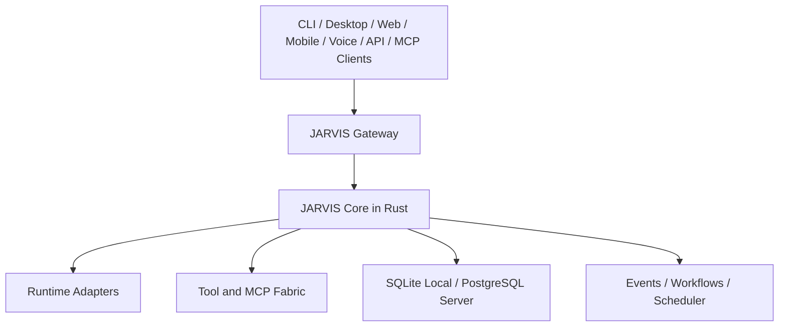

# JARVIS

JARVIS is a planned cross-platform personal AI operating system: a durable,
installable control plane for models, agent runtimes, tools, memory, workflows,
events, and voice.

Project state: **Milestone 0 specification complete; implementation has not
started. The next ready task is `FND-000` Foundation dependency research.**

The design goal is not another chat wrapper. JARVIS should remain stable while
models, providers, agent frameworks, databases, voice vendors, and interfaces
change around it.



## Core Position

- Rust is the durable control plane.
- `jarvisd` is the long-running daemon.
- `jarvis` is the CLI and administrative client.
- User interfaces are clients, not alternate brains.
- External agent frameworks are replaceable runtimes.
- MCP is an external capability protocol behind JARVIS policy.
- SQLite is the zero-infrastructure local default.
- PostgreSQL plus pgvector is the server and multi-device backend.
- JARVIS owns canonical memory, policy, approvals, and audit history.
- ElevenLabs is a replaceable voice/telephony provider, not JARVIS's brain.
- Remote access and side effects are deny-by-default.

## Product Modes

| Mode | Storage | Typical topology | Goal |
| --- | --- | --- | --- |
| Personal local | SQLite and local files | One daemon on one device | Install and use without infrastructure |
| Personal server | PostgreSQL and object storage | Always-on daemon plus multiple clients | Multi-device continuity and automation |
| Team | PostgreSQL, object storage, optional distributed services | Authenticated multi-tenant deployment | Shared workspaces with strict isolation |
| Portable | SQLite beside the binary | No service installation | Evaluation, recovery, and removable use |

## Start Building

1. Read [AGENTS.md](AGENTS.md).
2. Read [PRODUCT.md](PRODUCT.md) and [ROADMAP.md](ROADMAP.md).
3. Use [MASTER_BUILD_PROMPT.md](MASTER_BUILD_PROMPT.md) to start or resume an
   AI implementation session.
4. Run `node scripts/validate-docs.mjs`.
5. Select the first ready item in [TODO.md](TODO.md).
6. Complete upstream research and its manifest gate before touching an external
    integration or boundary-affecting dependency.

The root agent instructions are mandatory for human and AI-assisted changes.
They require current official documentation or `llms.txt` discovery for every
external integration.

## Planned Product Surfaces

- Native daemon and CLI for Windows, macOS, and Linux
- Tauri desktop client and browser client
- Versioned HTTP, WebSocket, SSE, local IPC, and MCP interfaces
- Provider-neutral model gateway
- Native resumable agent runtime plus external runtime adapters
- Canonical tool registry, policy engine, approvals, and audit log
- Typed memory and provenance-aware context engine
- Durable events, schedules, and workflows
- Connector lifecycle for email, calendar, files, GitHub, home, and more
- Inbound and outbound voice/telephone flows through replaceable providers
- Signed installers, updates, backup, restore, diagnostics, and support bundles

## Documentation

| Document | Purpose |
| --- | --- |
| [PRODUCT.md](PRODUCT.md) | Product scope, requirements, users, and v1 definition |
| [MASTER_BUILD_PROMPT.md](MASTER_BUILD_PROMPT.md) | Canonical prompt for an implementation agent |
| [ROADMAP.md](ROADMAP.md) | Ordered milestones and exit gates |
| [TODO.md](TODO.md) | Dependency-aware implementation backlog |
| [docs/README.md](docs/README.md) | Engineering documentation index |
| [SECURITY.md](SECURITY.md) | Security policy and baseline |
| [CONTRIBUTING.md](CONTRIBUTING.md) | Contribution workflow and quality bar |

## Target Repository Shape

The detailed crate boundaries will be created during Foundation, after contract
ADRs are accepted. The intended high-level layout is:

```text
apps/             daemon, CLI, desktop
crates/           Rust domain and application subsystems
adapters/         storage, models, runtimes, tools, connectors, voice
ui/               shared web frontend
migrations/       SQLite and PostgreSQL migrations
installers/       platform installers and service definitions
deploy/           optional server deployment assets
docs/             architecture, contracts, ADRs, research, plans, runbooks
tests/            cross-crate integration, contract, installer, and end-to-end tests
```

This is a specification repository today. Commands shown in planning documents
become valid only after the relevant milestone creates them.

## License

No license has been selected yet. Do not publish packages or copy third-party
source into this repository until the owner selects a license and the dependency
license policy is implemented.