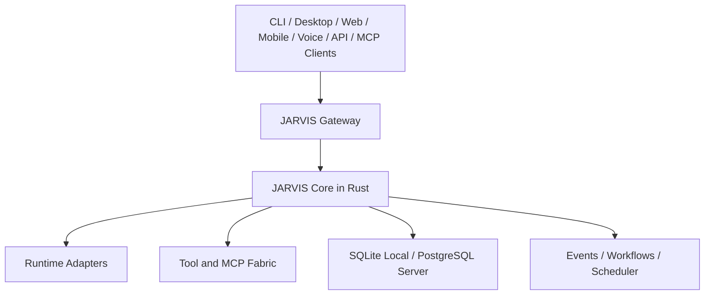

# JARVIS

JARVIS is a planned cross-platform personal AI operating system: a durable,
installable control plane for models, agent runtimes, tools, memory, workflows,
events, and voice.

Project state: **Milestone 0 specification and `FND-001`, `FND-002`, `FND-004`
through `FND-010` are complete or partially complete, with the path resolver,
the service lifecycle, and the CI lanes partially complete. The
Rust control plane now has typed IDs, UTC time, cancellation, request context,
domain errors, platform paths, layered versioned configuration with secret
references, structured JSON logging with sink-level secret redaction, SQLite
storage with embedded migrations and verified backup/restore, a daemon that
starts fail-closed, serves an authenticated local API, and drains within a bound,
a CLI whose `status` command was verified end-to-end against a running
daemon, per-user service lifecycle planning for systemd, launchd, and Windows
with no elevation, and a two-workflow CI pipeline whose native matrix builds,
tests, and runs a clean-machine journey on every tier-1 target. Bundled SQLite
needs a native C toolchain per target, which is why that proof runs natively rather
than by cross-compilation. Native Unix permission proof, the Windows ACL binding,
the OS credential store, native service registration, and the first real execution
of the CI workflows are still outstanding. `FND-010` is implemented as workflows
and a locally verified journey; `FND-011` release artifacts is the next ready
task.**

The design goal is not another chat wrapper. JARVIS should remain stable while
models, providers, agent frameworks, databases, voice vendors, and interfaces
change around it.



## Core Position

- Rust is the durable control plane.
- `jarvisd` is the long-running daemon.
- `jarvis` is the CLI and administrative client.
- User interfaces are clients, not alternate brains.
- External agent frameworks are replaceable runtimes.
- MCP is an external capability protocol behind JARVIS policy.
- SQLite is the zero-infrastructure local default.
- PostgreSQL plus pgvector is the server and multi-device backend.
- JARVIS owns canonical memory, policy, approvals, and audit history.
- ElevenLabs is a replaceable voice/telephony provider, not JARVIS's brain.
- Remote access and side effects are deny-by-default.

## Product Modes

| Mode | Storage | Typical topology | Goal |
| --- | --- | --- | --- |
| Personal local | SQLite and local files | One daemon on one device | Install and use without infrastructure |
| Personal server | PostgreSQL and object storage | Always-on daemon plus multiple clients | Multi-device continuity and automation |
| Team | PostgreSQL, object storage, optional distributed services | Authenticated multi-tenant deployment | Shared workspaces with strict isolation |
| Portable | SQLite beside the binary | No service installation | Evaluation, recovery, and removable use |

## Start Building

1. Read [AGENTS.md](AGENTS.md).
2. Read [PRODUCT.md](PRODUCT.md) and [ROADMAP.md](ROADMAP.md).
3. Use [MASTER_BUILD_PROMPT.md](MASTER_BUILD_PROMPT.md) to start or resume an
   AI implementation session.
4. Run `node scripts/validate-docs.mjs`.
5. Select the first ready item in [TODO.md](TODO.md).
6. Complete upstream research and its manifest gate before touching an external
    integration or boundary-affecting dependency.
7. Run `cargo fmt --check`,
    `cargo clippy --workspace --all-targets --all-features -- -D warnings`, and
    `cargo test --workspace` for Rust changes.

The root agent instructions are mandatory for human and AI-assisted changes.
They require current official documentation or `llms.txt` discovery for every
external integration.

## Planned Product Surfaces

- Native daemon and CLI for Windows, macOS, and Linux
- Tauri desktop client and browser client
- Versioned HTTP, WebSocket, SSE, local IPC, and MCP interfaces
- Provider-neutral model gateway
- Native resumable agent runtime plus external runtime adapters
- Canonical tool registry, policy engine, approvals, and audit log
- Typed memory and provenance-aware context engine
- Durable events, schedules, and workflows
- Connector lifecycle for email, calendar, files, GitHub, home, and more
- Inbound and outbound voice/telephone flows through replaceable providers
- Signed installers, updates, backup, restore, diagnostics, and support bundles

## Documentation

| Document | Purpose |
| --- | --- |
| [PRODUCT.md](PRODUCT.md) | Product scope, requirements, users, and v1 definition |
| [MASTER_BUILD_PROMPT.md](MASTER_BUILD_PROMPT.md) | Canonical prompt for an implementation agent |
| [ROADMAP.md](ROADMAP.md) | Ordered milestones and exit gates |
| [TODO.md](TODO.md) | Dependency-aware implementation backlog |
| [docs/README.md](docs/README.md) | Engineering documentation index |
| [SECURITY.md](SECURITY.md) | Security policy and baseline |
| [CONTRIBUTING.md](CONTRIBUTING.md) | Contribution workflow and quality bar |

## Repository Shape

The first Foundation boundary is now present:

```text
apps/
    jarvisd/                 daemon composition root
    jarvis-cli/              thin `jarvis` client composition root
crates/
    jarvis-domain/           infrastructure-free domain types and ports
    jarvis-application/      application orchestration
    jarvis-protocol/         versioned process-boundary types
    jarvis-infrastructure/   storage and operating-system adapters
    jarvis-observability/    local structured diagnostics
tests/e2e/                 packaged cross-process acceptance tests
```

This is a compiling ownership scaffold, not a runnable daemon claim. Later
directories are added only with the behavior that exercises them.

## License

No license has been selected yet. Do not publish packages or copy third-party
source into this repository until the owner selects a license and the dependency
license policy is implemented.