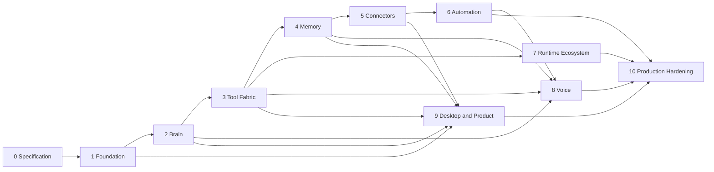

# JARVIS Roadmap

Status: ACCEPTED
Last updated: 2026-09-22
Current milestone: Milestone 2 - Native Brain (started; `BRN-001`, `BRN-002`, `BRN-004`, `BRN-005`, and `BRN-006` done, `BRN-007`'s run resource surface and CLI chat path partially done with the live SSE follow outstanding, `BRN-008`'s run controller, startup recovery, time budgets, and repository test doubles partially done, `BRN-003` gated on evidence. Milestone 1 is complete apart from `OWN-001` through `OWN-005`, which are owner-gated)

Milestone 0 exit status: DONE. Evidence is recorded in `TODO.md` and validated
by `node scripts/validate-docs.mjs`.

Milestones are ordered by dependency and proof, not feature excitement. A later
milestone may begin early only when it does not weaken an earlier boundary or
create an unverified parallel implementation.

## Delivery Rule

A milestone exits only when its acceptance scenarios run from packaged artifacts
where applicable. Source compilation alone is not product proof.

## Milestone 0: Specification and Contracts

Goal: make implementation decisions explicit, testable, and navigable.

Deliverables:

- Product requirements and non-goals
- Architecture and trust-boundary documents
- Accepted bootstrap ADRs
- Runtime, tool, event, approval, and streaming contracts
- Normative local daemon/client discovery, authentication, run, and SSE contract
- Conceptual data model and migration rules
- Threat model, test strategy, release strategy, and risk register
- Upstream project study and integration source registry
- Dependency-aware TODO and requirement traceability
- Foundation implementation and release-governance handoff

Exit gate:

- Every v1 requirement maps to a milestone and acceptance scenario.
- Local Markdown links pass.
- No architecture document claims code exists.
- Unknown third-party behavior is labelled `UNVERIFIED`.

## Milestone 1: Installable Foundation

Goal: prove a cross-platform daemon/client product shell before agent complexity.

Deliverables:

- Current official evidence for the selected Rust toolchain, targets, crates,
  SQLite behavior, and operating-system facilities
- Minimal Cargo workspace and pinned Rust toolchain
- Domain IDs, clock, config, paths, error, cancellation, and event primitives
- `jarvisd` lifecycle with loopback health/readiness endpoints
- `jarvis` status, config, service, logs, and doctor commands
- Previewed repair plans and reviewable redacted support bundles
- Authenticated local client/daemon transport
- SQLite migrations, repository health, backup, and restore skeleton
- Structured tracing with redaction and correlation IDs
- Per-user service definitions for Windows, macOS, and Linux
- Native release artifacts, checksums, isolated test signatures, SBOM,
  provenance, and install/update/uninstall paths

Exit gate:

- Clean-install smoke tests pass on Windows x86_64, macOS arm64/x86_64, Linux
  x86_64, and Linux aarch64.
- No development runtime is required on the target machine.
- Daemon startup, stop, restart, stale lock, port conflict, corrupt config, and
  unsupported migration have actionable diagnostics.
- Consumer-side verification rejects modified artifacts and update metadata.
- Public promotion remains blocked until `OWN-001` through `OWN-005` are
  completed; test-signing evidence does not imply production signing authority.

## Milestone 2: Native Brain

Goal: one durable, streamed text conversation through a provider-neutral core.

Deliverables:

- Model/provider ports and capability inventory
- Deterministic fake provider
- First researched OpenAI-compatible provider adapter
- Native run state machine and normalized runtime events
- Durable sessions, messages, runs, steps, model calls, usage, and errors
- Context budgeter for identity, conversation, and active task
- Measured incremental-delivery capability per model (time to first token and
  token spread), not a streaming boolean
- Visible model data-use, retention, locality, and telemetry policy
- HTTP/SSE and CLI chat surfaces
- Cancellation, timeout, fallback, and restart semantics

Exit gate:

- Fake-provider tests are deterministic.
- A gated real-provider smoke test streams a response.
- Killing a client does not corrupt the run; cancellation behavior is explicit.

## Milestone 3: Governed Tool Fabric

Goal: every capability uses one safe execution path.

Deliverables:

- Canonical tool definition and registry
- JSON Schema validation and stable tool identity
- Effect/risk classification and policy engine
- Durable approvals and exact action fingerprints
- Idempotent tool-call ledger, timeouts, cancellation, and output limits
- Reference read-only and approval-required local tools
- MCP client/host for stdio and Streamable HTTP
- Scoped MCP server export with protocol negotiation and auth
- Plugin manifest, process supervision, and permission grant model
- Plugin package verification, install-disabled lifecycle, update/rollback,
  quarantine, and removal
- Authenticated CLI/API approval list, preview, decide, expiry, and revocation

Exit gate:

- A denied model request cannot bypass policy through native, MCP, or runtime
  routes.
- Approval survives daemon restart and causes one side effect at most.
- MCP conformance/inspector tests pass for the supported version matrix.

## Milestone 4: Canonical Memory and Context

Goal: useful memory that is inspectable, correctable, and workspace-safe.

Deliverables:

- Typed memory lifecycle and provenance model
- Explicit policy and lifecycle for all seven product memory classes
- User-confirmed preference memory first
- Lexical retrieval in SQLite and hybrid retrieval in PostgreSQL
- Embedding adapter and versioned embedding metadata
- Entity resolution with confidence and non-merge path
- Context selection ledger, sensitivity filters, and token budgets
- Inspect, correct, supersede, archive, forget, export, and disable flows

Exit gate:

- The restart memory proof in the product spec passes.
- Cross-workspace retrieval is impossible in query-level tests.
- Conflicting and expired memories behave deterministically.

## Milestone 5: Connector Platform

Goal: integrations can be added and operated without changing core orchestration.

Deliverables:

- Connector SDK, manifest schema, lifecycle, and quality checklist
- OAuth 2.1/PKCE broker and credential-reference store
- Webhook ingress, verification, deduplication, and outbox handoff
- Rate limit, retry, pagination, incremental sync, and diagnostics primitives
- First vertical connector: choose Google or Microsoft after research
- GitHub connector and generic webhook reference connector
- Reauth, disable, unload, migration, delete, and support bundle behavior

Exit gate:

- One email/calendar workflow works through a dedicated test account.
- Revoking credentials stops access and produces actionable reauth state.
- Connector quality checklist is enforced in CI.

## Milestone 6: Durable Events and Automation

Goal: JARVIS safely acts over time and in response to external events.

Deliverables:

- Versioned event envelope and durable outbox/inbox
- Scheduler and claimed-job leases
- Native persisted workflow state machine
- Sequence, parallel, condition, timer, retry, event wait, approval, cancellation,
  and compensation steps
- Quiet hours, notification policy, budgets, and proactive rules
- Crash/restart and duplicate-delivery test harness

Exit gate:

- A scheduled approval workflow resumes after process termination at each wait
  boundary and produces one external effect.
- Replay and duplicate delivery do not duplicate side effects.

## Milestone 7: Runtime Ecosystem

Goal: external runtimes are useful without becoming JARVIS.

Deliverables:

- Versioned runtime protocol and SDK
- Process supervisor, capability negotiation, heartbeat, quotas, and cancellation
- OpenClaw adapter
- OpenAI Agents adapter
- ACP adapter, with Codex/Goose as test runtimes where compatible
- LangGraph adapter for graph-shaped workloads
- Runtime checkpoint references, artifacts, and reconciliation

Exit gate:

- The same client starts native and external-runtime tasks.
- Runtime crash, hang, malformed events, and version mismatch are contained.
- External runtimes receive only scoped JARVIS tool capabilities.

## Milestone 8: Voice and Telephony

Goal: voice feels like JARVIS while the control plane remains authoritative.

Deliverables:

- `VoiceProvider` port and normalized call/session events
- OpenAI-compatible `/v1/responses` and `/v1/chat/completions` SSE surfaces
- ElevenLabs Custom LLM mode with system-tool semantics
- ElevenLabs MCP-client mode with narrow exports
- Inbound identity/session binding and post-call webhook verification
- Outbound call connector, consent/legal policy, quiet hours, budget, and callbacks
- End, transfer, interruption, voicemail, and partial transcript handling
- Model-based end-of-turn detection with a confidence threshold and a
  partial-transcript channel, replacing silence-only turn taking
- Carrier adapter with explicit pipeline attributes, single-point mode selection,
  and mode selection asserted in tests
- Provider-neutral call state controller with callback ordering, latency, and
  bounded cleanup
- Measured perceived-latency budget reported per component and per pipeline
- Provider-independent local voice spike after the hosted path is stable

Exit gate:

- Inbound and outbound acceptance scenarios pass in a dedicated test account.
- No call can access a workspace from unverified caller metadata.
- Call retries cannot ring the user twice for one idempotency key.
- The recorded perceived-latency budget passes at p50 and p95 on a real call, with
  end-of-turn detection reported separately from generation.
- Partial text never enters durable state and never executes a tool.

## Milestone 9: Desktop and Product Experience

Goal: a polished native client without duplicating daemon logic.

Deliverables:

- Tauri v2 desktop client with generated API bindings
- Onboarding, chat, activity, approvals, memory, tasks, connections, models,
  runtimes, tools, voice, settings, and developer console
- Capability-scoped frontend permissions and strict CSP
- Signed auto-update with rollback/recovery UX
- Accessibility, keyboard, localization, offline, reconnect, and error states

Exit gate:

- Desktop end-to-end tests pass on tier-1 platforms.
- Frontend compromise cannot directly access secrets or execute tools.
- Update and failed-update recovery are tested from packaged prior versions.

## Milestone 10: Production Hardening

Goal: make server/team deployments and long-term operations supportable.

Deliverables:

- PostgreSQL/pgvector production profile and object storage
- Supported non-root server-container lifecycle
- Multi-user auth, service accounts, workspace RBAC, quotas, and audit export
- Horizontal worker and event backend evaluation from measured load
- Temporal adapter only if native workflow limits are demonstrated
- Disaster recovery, key rotation, retention, data export/delete, and incident drills
- Cross-aggregate crash-consistency, migration, compatibility, and rollback matrix
- SLOs, capacity tests, fuzzing, penetration review, SBOM, provenance, and staged
  release channels

Exit gate:

- Recovery point/time objectives are tested.
- Tenant isolation and authorization receive independent security review.
- Operational load tests justify any distributed infrastructure introduced.