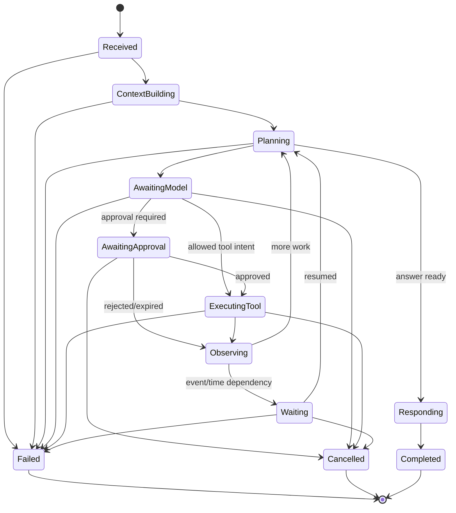

# Agent and Runtime Model

Status: PROPOSED

## Two Layers

JARVIS distinguishes the durable run controller from the selected reasoning
runtime.

- The **run controller** owns identity, state, context references, policy,
  approvals, tool outcomes, public events, cancellation, and completion.
- The **runtime** proposes reasoning steps, model calls, tool intents, and a final
  response according to its own strategy.

The controller remains authoritative even when the native runtime is selected.

## Native Run State Machine



State names are domain concepts, not UI strings. A transition records actor,
reason, expected prior version, timestamp, and correlation metadata.

## Durable Run Record

A run minimally tracks:

- run, session, conversation, principal, workspace, and parent IDs;
- objective and public input references;
- selected runtime and version;
- state and optimistic version;
- context manifest reference;
- current plan summary and step cursor;
- pending approval, timer, event, or runtime checkpoint references;
- model/tool usage and budget state;
- cancellation and deadline state;
- final response/artifact references or normalized error;
- created, started, updated, and completed timestamps.

Large model content, artifacts, and raw provider payloads are stored separately
with retention and sensitivity metadata.

## Step Semantics

Each nondeterministic or externally visible operation is a durable step:

- build context;
- call model;
- request approval;
- execute tool;
- wait for time/event;
- invoke/resume external runtime;
- write memory candidate;
- produce final response.

A step has an idempotency key, input fingerprint, attempt count, state, timeout,
result/error reference, and timestamps. Retrying a step reuses identity unless a
new logical operation is explicitly created.

## Public Activity Events

Clients receive concise normalized events such as:

```text
run.started
context.ready
model.started
model.output.delta
tool.requested
approval.required
tool.started
tool.completed
run.waiting
response.delta
run.completed
run.failed
run.cancelled
```

Events never expose hidden chain-of-thought. A runtime may provide a short
reasoning summary, but JARVIS classifies and stores it separately from internal
provider reasoning fields.

## Native Runtime

The native runtime should start deliberately small:

1. Receive objective and bounded context.
2. Ask a model for either a final response or typed tool intent.
3. Route tool intent through JARVIS policy/execution.
4. Append a bounded observation.
5. Repeat within turn, token, cost, time, and tool budgets.
6. Produce a final response or explicit waiting/failure state.

Planning is a strategy, not a mandatory extra model call. Simple tasks should
not pay for a complex plan.

## External Runtime Contract

An external runtime adapter must support capability discovery and a subset of:

```rust,ignore
trait AgentRuntime {
    fn descriptor(&self) -> RuntimeDescriptor;
    async fn start(&self, request: RuntimeRequest) -> RuntimeEventStream;
    async fn resume(&self, request: RuntimeResumeRequest) -> RuntimeEventStream;
    async fn cancel(&self, run: RuntimeRunId) -> Result<(), RuntimeError>;
    async fn health(&self) -> RuntimeHealth;
}
```

The wire protocol, not this illustrative trait, is the interoperability
contract. It must negotiate protocol version and capabilities, including:

- streaming and backpressure;
- tool-intent delegation versus runtime-owned tools;
- resume/checkpoint support;
- cancellation and interrupt input;
- files/artifacts;
- multimodal input/output;
- sandbox or workspace requirements;
- usage/cost reporting;
- protocol extensions.

Unsupported capabilities fail before execution, not halfway through a run.

## Runtime Tool Access

Preferred mode: the runtime emits a tool intent and JARVIS executes it. When a
runtime requires direct tool protocol access, JARVIS gives it an ephemeral,
run-scoped MCP endpoint or capability token exposing only the selected tools.
All calls still use the canonical tool pipeline.

Never pass connector credentials or a general JARVIS admin token to a runtime.

## Resume and Reconciliation

Runtime-native checkpoint IDs are opaque references. On resume:

1. Load the JARVIS run and expected state.
2. Validate runtime identity/version and checkpoint ownership.
3. Reconcile previously persisted tool calls and artifacts.
4. Mint fresh scoped capabilities.
5. Ask the runtime to resume from its checkpoint.
6. Reject duplicate completion or tool-intent events by stable event/call ID.

If a runtime claims completion but required artifacts or tool outcomes are
missing, the JARVIS run enters a reconciliation error, not `Completed`.

## Conversational Runs vs Workflows

A run is an agent interaction. A workflow is durable business orchestration that
may invoke many runs. A three-day timer or Monday schedule belongs to the
workflow engine, not an open model stream. A workflow step can call a runtime,
wait for approval, then continue independently of the original conversation.

## Safety and Limits

Every run has explicit maximums for:

- elapsed and active execution time;
- model turns, tokens, and estimated cost;
- tool calls and concurrent tools;
- context and observation bytes;
- artifact count/size;
- retries and runtime restarts;
- nested/delegated run depth.

Crossing a limit emits a typed terminal or waiting condition with an operator-
and user-actionable explanation.