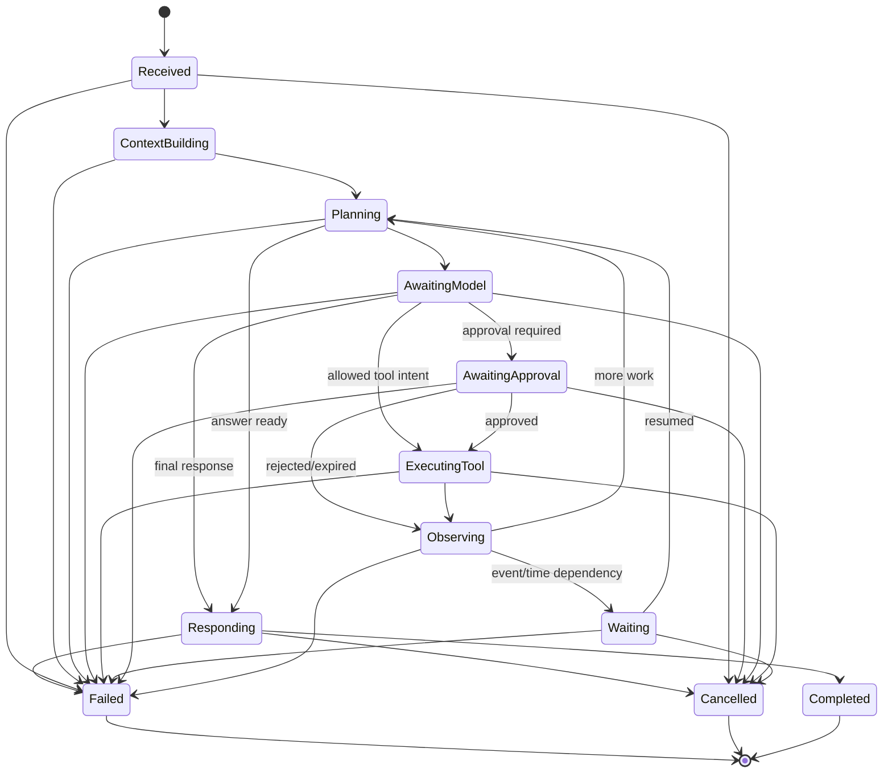

# Agent and Runtime Model

Status: PROPOSED

## Two Layers

JARVIS distinguishes the durable run controller from the selected reasoning
runtime.

- The **run controller** owns identity, state, context references, policy,
  approvals, tool outcomes, public events, cancellation, and completion.
- The **runtime** proposes reasoning steps, model calls, tool intents, and a final
  response according to its own strategy.

The controller remains authoritative even when the native runtime is selected.

## Native Run State Machine



Six edges have been **added** to this diagram, and the reason is worth recording
because each was a defect the diagram had rather than a stylistic choice:

- `AwaitingModel --> Responding`. Without it the native runtime's own instruction —
  "ask a model for either a final response or typed tool intent" — had no legal
  completion path: a plain question-and-answer run could reach neither `Responding`
  nor `Completed` and would sit in `AwaitingModel` forever. The
  [first vertical slice](../planning/first-vertical-slice.md) already named the
  minimal machine as "received, context, model, responding, completed", so the edge
  was missing from this diagram, not from the design.
- `Responding --> Failed` and `Responding --> Cancelled`. Producing the answer is
  where a provider failure and a caller's cancellation actually arrive, and
  `ACC-012` requires that a disconnect "never becomes false `Completed`" while
  `ACC-016` requires cancelling during streaming. With `Completed` as the only
  successor, neither could be persisted truthfully.
- `Received --> Cancelled`. A run can be cancelled before its first step, and the
  local control API requires a cancellation to reach a durable terminal transition.
  Without this edge such a run was **permanently non-terminal**: the controller had
  no legal way to record the cancellation, so a client polling the run waited forever
  for an answer that had already been abandoned. This one was found by driving the
  run service end to end rather than by reading the diagram.
- `AwaitingApproval --> Failed` and `Observing --> Failed`. These two were the only
  non-terminal states from which `Failed` was unreachable, and that made the
  **restart-recovery rule unimplementable**: the local control API requires a
  non-terminal run found at startup to be recovered "to an explicit resumable or
  failed state", and a run interrupted while awaiting a decision or while folding
  back a tool outcome had no legal way to become either. This is the **fourth** time
  an edge absent from this diagram turned out to be a defect in the diagram, and the
  pattern is now worth stating plainly: the diagram has twice omitted the edges
  needed to record a *failure* or a *cancellation*, so it has been an optimistic
  diagram — every state could progress, and only some could admit that progress had
  stopped.

State names are domain concepts, not UI strings. A transition records actor,
reason, expected prior version, timestamp, and correlation metadata.

### Implemented evidence (`BRN-005`)

`jarvis_domain::run` implements this state machine, so the edges above are
enforced rather than restated. `RunState::allowed_targets` is the diagram
transcribed, and `RunLifecycle::apply` is the single place a change is decided:
the state is **private**, so an edge the diagram does not contain cannot be
reached by assigning to a field.

Four rules are structural rather than documented:

- **Terminal states absorb.** `Completed`, `Failed`, and `Cancelled` have no
  successors, so a late worker cannot resurrect a finished run — and a second
  terminal event, which the local control API forbids, is unreachable.
- **A transition carries provenance.** `RunTransition` supplies the actor, the
  bounded reason, the expected prior version, the instant, and an optional
  correlation ID; `RunTransitionRecord` describes what was *applied*, including
  both the prior and the resulting version, because "the state changed" is not
  auditable on its own.
- **Optimistic concurrency, and a stated check order.** The refusals are ordered
  terminal → version → edge so a caller receives the most specific true answer: an
  illegal edge computed from a stale view may be legal from the current state, so a
  stale caller is told its view is stale first. `RunVersionConflict` is the one
  domain error that is **retryable**, because re-reading and recomputing is exactly
  what stating an expected version is for.
- **Waiting is explicit and distinct from failure.** `AwaitingApproval` and
  `Waiting` are named states, so a run parked on a dependency does not look like a
  run that is merely not progressing.

**Two questions this transcription surfaced, both now resolved:**

1. The diagram gave `Responding` exactly one successor (`Completed`), so neither a
   provider failure nor a cancellation *while producing the final answer* was
   expressible. **Resolved by adding `Responding --> Failed` and
   `Responding --> Cancelled`** to the diagram above, because producing the answer
   is where both actually arrive and `ACC-012`/`ACC-016` require them to be
   persistable. A third, related gap was found at the same time and is described
   under the diagram: `AwaitingModel --> Responding` was missing, which left a plain
   question-and-answer run with no legal path to `Completed` at all. The tests are
   `a_failure_or_cancellation_during_the_answer_is_expressible` and
   `a_plain_question_and_answer_path_reaches_completed`, plus the repository-level
   `a_plain_question_and_answer_run_persists_through_to_completed`.
2. The client-visible states in the
   [local control API](../contracts/local-control-api.md) are a **coarser** set
   than the controller's, and this module holds no projection function on purpose
   (the sentence above forbids domain states doubling as UI strings). The mapping
   is therefore `BRN-007`'s to implement at the API boundary, where the wire
   contract is owned, and it must be total over the non-terminal states.

**A lesson worth keeping:** the original `BRN-005` "happy path" test drove
`Planning -> Responding` and so never visited `AwaitingModel`; every edge it used
was legal, so it passed while the product's primary ask-and-answer path was
unreachable. A happy-path test that avoids a state proves nothing about that state,
which is why the repository suite now drives the real path rather than a legal
convenience path.

### Implemented evidence (`BRN-008`, run control)

`jarvis_application::run_controller` is the loop that drives the machine above, and
is what the "run controller" in this document's opening means in code. Its shape is
the **native runtime** list of steps 1, 2, and 6: receive the objective and bounded
context, ask a model for a final response or a typed tool intent, and produce a final
response or an explicit terminal state. `RunController::execute` advances the state
machine through the run repository, reads the transcript, performs the model turn
through `ModelProvider`, and persists **every** transition with its public event in
the same write — a state that moved without an event would be a silent gap in the
audit trail, so the fused repository call is the only way the controller changes a
state.

Four rules are structural:

- **Frames are admitted by the domain, not by the controller.** `ModelStreamState`
  decides ordering, duplicates, and terminal absorption, so the controller holds no
  second copy of the contract's rules and cannot disagree with them. A stream that
  ends without a terminal is the domain's `StreamOutcome::Interrupted`, which maps to
  `Failed` — never to `Completed`.
- **A cancelled call ends `Cancelled`, not `Failed`.** `ControllerError`'s
  `terminal_state` is the one place that decides, so the caller's own action is
  never recorded as a fault.
- **A tool intent is refused, not faked.** The tool fabric is Milestone 3, so a
  model that proposes a tool call ends the run with a typed
  `run.tools_not_implemented`; `is_unimplemented` distinguishes that known gap from a
  fault. The controller performs exactly **one** model turn, because a loop that
  cannot iterate a second time would be a claim with no behaviour behind it.
- **A misconfiguration fails before the run waits.** The model roster is checked
  from `Planning`, so a provider serving no model reaches `Failed` rather than
  `AwaitingModel` — checking it later left a run waiting for a call that could never
  be made, in a state with no legal way out.

The repository **test doubles** (`jarvis_application::testing`) are shipped rather
than test-only for the same reason the scripted provider is: a controller test needs
a store, and a paid database cannot be the only way to exercise orchestration. The
doubles deliberately do not reimplement the transition table — they delegate edge
legality, version ordering, and terminal absorption to `RunLifecycle`, exactly as the
SQLite adapter does, and add only the storage semantics (transaction-and-event
fusion, uniqueness, scope as a query predicate). A double that copied the rules would
be a second implementation that could disagree with the first, and a test passing
against it would prove only self-consistency.

**Two questions this work surfaced:**

1. Should the controller retry a retryable provider error? **Not yet.** Retry,
   fallback, and the retry-ownership rule belong with `BRN-008`'s remaining work and
   the model gateway, and a retry without a recorded attempt would duplicate a side
   effect — the model-call repository already models a retry as an *attempt* of one
   logical call, which is what that work will use.
2. Where does a run that suspends go? `Waiting` exists in the machine and the
   controller does not enter it, because **nothing suspends and resumes yet** —
   approvals and timers are later milestones. Entering `Waiting` with nothing to wait
   on would be the same kind of false record the state machine's consistency rules
   exist to prevent.

### Implemented evidence (`BRN-008`, startup recovery)

The restart half of this document's durability rule now has code: the local control
API's "non-terminal runs are recovered to an explicit resumable or failed state" is
implemented as `jarvis_domain::run::recovery` (the classification) plus
`jarvis_application::recovery::reconcile` (the pass), called from `jarvisd` startup.

The classification is the **domain's**, not the service's. Which states an
interrupted run may be found in, and what each one means, is a statement about the
state machine, so putting it beside the machine is what stops the daemon and the
client disagreeing about it. `classify` is an exhaustive match over the twelve states,
so a new state fails to compile rather than defaulting to "leave it alone" — and
"leave it alone" is exactly the wrong default, because it is the one that leaves a run
non-terminal forever.

Two consequences of this work are worth recording:

1. **Nothing is resumed, and the code says so.** Both classifications settle a run at
   `Failed`; a parked run is classified separately (`was_resumable`, plus `parked_in`
   in the event payload) so the distinction is recorded, but the outcome is the same.
   Resuming means re-running a model call, and nothing knows what the interrupted call
   produced — inferring a result from partial output is precisely what this document
   forbids. The state machine models a resumable wait (`Waiting` carries a
   `WaitingOn`); the recovery path does not yet use it, and that is a gap rather than
   a design.
2. **A parked run cannot be re-woken.** `AwaitingApproval` and `Waiting` are settled
   `Failed` because no dependency a run could be waiting on exists yet, so there is
   nothing that could satisfy it. When approvals and timers land, the
   `RecoveryAction::Resumable` classification is already where their resume hook
   belongs — the payload and the actor already distinguish the case, so the change is
   to the action's target rather than to the read, the write, or the report.

The pass is safe to run against a live database for one structural reason: the
transition it writes carries the version it **read**, so a run that completed in
between is refused rather than overwritten. That is what keeps a real outcome from
being replaced by a failure, and it is asserted directly.

### Implemented evidence (`BRN-008`, budgets)

This document's native-runtime step 5 says "repeat within turn, token, cost, time,
and tool budgets", and its "durable run record" list includes "model/tool usage and
budget state". The **time** half of that is implemented.

`jarvis_domain::run::budget` holds the budget and the pure arithmetic that decides
whether it is spent. The arithmetic is in the domain because the answer must not
depend on which layer asks: the controller, a future workflow engine, and a future
tool ledger all spend the same budget the same way. `BudgetStatus` is deliberately
three-valued — `Unbounded`, `Remaining`, `Expired` — because "there is no deadline"
and "the deadline is far away" are different facts, and a boolean would make an
unbounded run indistinguishable from a comfortable one. The deadline instant itself
counts as expired, so the answer never depends on sub-nanosecond timing.

Two things were wrong before this, and both were silent:

- **A run had no deadline at all.** `agent_runs.deadline_at` and `budget_json` were
  schema columns with no port able to populate them, so they were always NULL, and
  the budget the run was created under could not be read back. That is the storage
  architecture's "a column that can never be correct" shape, and it was invisible
  because nothing read them.
- **The controller sent no deadline to the provider.** `build_request` set
  `limits.deadline: null` unconditionally, so a provider honouring the contract's own
  `limits.deadline` had nothing to honour, and the contract's per-call budget was
  decorative. This is the same class of defect as the unmodelled `settings` block
  found in `BRN-001`: a contract field the code carried but never populated.

The controller now bounds **both** awaits — the provider `open` and each individual
frame wait — so a provider that never answers and a provider that stalls mid-stream
are both bounded. The bound is re-derived per frame rather than fixed at the first
one: a stream that has already consumed most of its time has little left, and
bounding it by the original allowance would let it exceed the run's own limit. A run
whose deadline had already passed is failed from `AwaitingModel` **before a provider
is contacted**, so no model call is recorded and nothing is billed.

`ProviderError::Timeout` is a new, separate variant. A deadline JARVIS set is not the
same fact as an unreachable provider: an operator reading a provider fault looks at
the provider's status page, while the answer here is in the configured budget. It is
also deliberately **not** retryable — an expired deadline leaves no budget to retry
inside, and the retry decision belongs to whichever layer owns the budget.

**What is not implemented, and is not claimed:** the token and cost ceilings are
carried into the request but nothing sums usage against them, so a run cannot yet
*refuse* a step for exceeding a token budget; there is no turn budget, because the
controller still performs exactly one model turn; and `agent_steps.timeout_ms` has no
port, so per-step timeouts exist only as the run-level `step_timeout_ms`. `ACC-073`
therefore remains open for token, cost, byte, retry, and concurrency exhaustion.

## Durable Run Record

A run minimally tracks:

- run, session, conversation, principal, workspace, and parent IDs;
- objective and public input references;
- selected runtime and version;
- state and optimistic version;
- context manifest reference;
- current plan summary and step cursor;
- pending approval, timer, event, or runtime checkpoint references;
- model/tool usage and budget state;
- cancellation and deadline state;
- final response/artifact references or normalized error;
- created, started, updated, and completed timestamps.

Large model content, artifacts, and raw provider payloads are stored separately
with retention and sensitivity metadata.

## Step Semantics

Each nondeterministic or externally visible operation is a durable step:

- build context;
- call model;
- request approval;
- execute tool;
- wait for time/event;
- invoke/resume external runtime;
- write memory candidate;
- produce final response.

A step has an idempotency key, input fingerprint, attempt count, state, timeout,
result/error reference, and timestamps. Retrying a step reuses identity unless a
new logical operation is explicitly created.

## Public Activity Events

Clients receive concise normalized events such as:

```text
run.started
context.ready
model.started
model.output.delta
tool.requested
approval.required
tool.started
tool.completed
run.waiting
response.delta
run.completed
run.failed
run.cancelled
```

Events never expose hidden chain-of-thought. A runtime may provide a short
reasoning summary, but JARVIS classifies and stores it separately from internal
provider reasoning fields.

## Native Runtime

The native runtime should start deliberately small:

1. Receive objective and bounded context.
2. Ask a model for either a final response or typed tool intent.
3. Route tool intent through JARVIS policy/execution.
4. Append a bounded observation.
5. Repeat within turn, token, cost, time, and tool budgets.
6. Produce a final response or explicit waiting/failure state.

Planning is a strategy, not a mandatory extra model call. Simple tasks should
not pay for a complex plan.

## External Runtime Contract

An external runtime adapter must support capability discovery and a subset of:

```rust,ignore
trait AgentRuntime {
    fn descriptor(&self) -> RuntimeDescriptor;
    async fn start(&self, request: RuntimeRequest) -> RuntimeEventStream;
    async fn resume(&self, request: RuntimeResumeRequest) -> RuntimeEventStream;
    async fn cancel(&self, run: RuntimeRunId) -> Result<(), RuntimeError>;
    async fn health(&self) -> RuntimeHealth;
}
```

The wire protocol, not this illustrative trait, is the interoperability
contract. It must negotiate protocol version and capabilities, including:

- streaming and backpressure;
- tool-intent delegation versus runtime-owned tools;
- resume/checkpoint support;
- cancellation and interrupt input;
- files/artifacts;
- multimodal input/output;
- sandbox or workspace requirements;
- usage/cost reporting;
- protocol extensions.

Unsupported capabilities fail before execution, not halfway through a run.

## Runtime Tool Access

Preferred mode: the runtime emits a tool intent and JARVIS executes it. When a
runtime requires direct tool protocol access, JARVIS gives it an ephemeral,
run-scoped MCP endpoint or capability token exposing only the selected tools.
All calls still use the canonical tool pipeline.

Never pass connector credentials or a general JARVIS admin token to a runtime.

## Resume and Reconciliation

Runtime-native checkpoint IDs are opaque references. On resume:

1. Load the JARVIS run and expected state.
2. Validate runtime identity/version and checkpoint ownership.
3. Reconcile previously persisted tool calls and artifacts.
4. Mint fresh scoped capabilities.
5. Ask the runtime to resume from its checkpoint.
6. Reject duplicate completion or tool-intent events by stable event/call ID.

If a runtime claims completion but required artifacts or tool outcomes are
missing, the JARVIS run enters a reconciliation error, not `Completed`.

## Conversational Runs vs Workflows

A run is an agent interaction. A workflow is durable business orchestration that
may invoke many runs. A three-day timer or Monday schedule belongs to the
workflow engine, not an open model stream. A workflow step can call a runtime,
wait for approval, then continue independently of the original conversation.

## Safety and Limits

Every run has explicit maximums for:

- elapsed and active execution time;
- model turns, tokens, and estimated cost;
- tool calls and concurrent tools;
- context and observation bytes;
- artifact count/size;
- retries and runtime restarts;
- nested/delegated run depth.

Crossing a limit emits a typed terminal or waiting condition with an operator-
and user-actionable explanation.