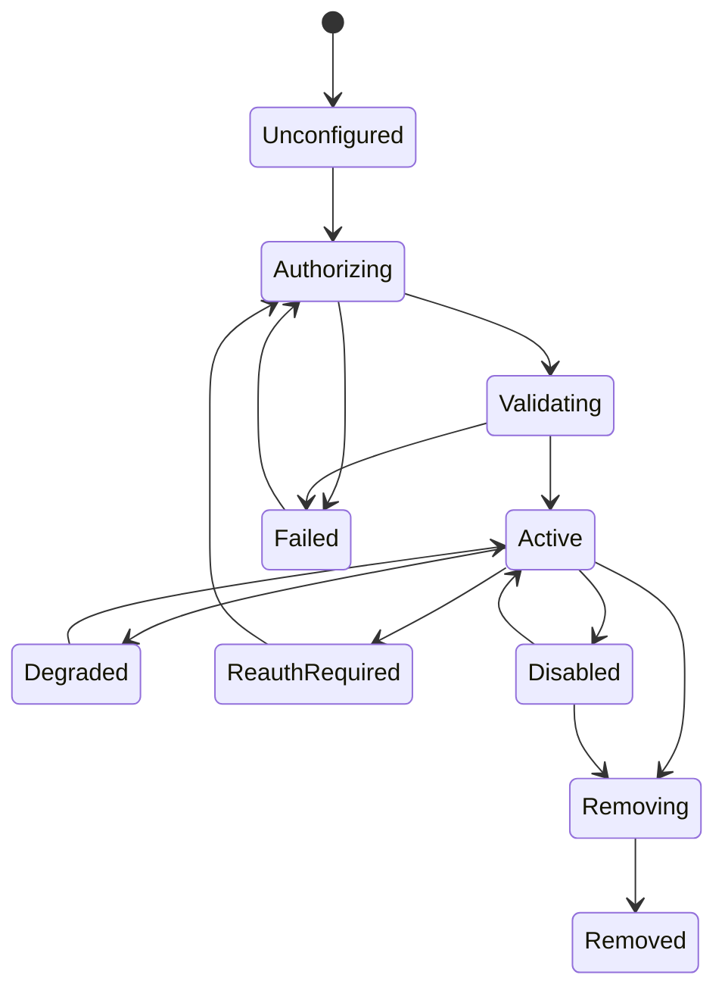

# Connector Platform

Status: PROPOSED

## Purpose

A connector integrates an external account, service, device, or event source.
It translates provider concepts into JARVIS tools/events/resources while owning
provider authentication, lifecycle, normalization, rate limits, and diagnostics.

Connectors do not expose provider SDK types to the domain and do not become
canonical memory stores.

## Connector Manifest

Each connector has a validated manifest containing:

```text
id, name, version, owner
integration type and data-flow class
supported OS/deployment profiles
auth strategies and required scopes
capabilities/tools/events/resources
configuration schema
secret references
webhook/discovery/polling modes
rate-limit and retry defaults
privacy/retention/residency links
documentation, evidence, diagnostics, and support links
minimum JARVIS/protocol versions
quality status and known limitations
```

The connector directory name, manifest ID, tool namespace, and configuration
namespace must agree. Validate manifests in CI.

## Lifecycle



Required operations:

- discover/setup and test before commit;
- activate and load capabilities;
- health probe and freshness/completeness report;
- refresh credentials and trigger reauthentication;
- update configuration safely;
- disable/unload without deleting configuration;
- migrate configuration/cursors;
- remove remote subscriptions/webhooks where possible;
- delete local state and revoke credentials;
- produce redacted diagnostics.

Setup validates real access with the minimum harmless request. Saving an API key
without testing it is not successful setup.

## Suggested Layout

```text
adapters/connectors/<connector>/
  manifest.json
  README.md
  src/
    auth.rs
    client.rs
    config.rs
    connector.rs
    diagnostics.rs
    errors.rs
    events.rs
    normalize.rs
    sync.rs
    tools.rs
    webhook.rs
  tests/
    fixtures/
    contract/
    live/
  quality.yaml
```

Only include modules the connector needs. The layout communicates ownership; it
is not a demand for empty files.

## Connector Port

The application-facing contract covers lifecycle and capability registration.
Provider-specific operations remain behind canonical tools/resources/events.

```rust,ignore
trait Connector {
    fn descriptor(&self) -> ConnectorDescriptor;
    async fn validate(&self, context: ConnectorContext) -> ConnectorHealth;
    async fn activate(&self, context: ConnectorContext) -> ConnectorLease;
    async fn deactivate(&self, lease: ConnectorLease) -> Result<(), ConnectorError>;
    async fn diagnostics(&self, context: ConnectorContext) -> SafeDiagnostics;
}
```

The concrete contract must support cancellation and avoid long-lived borrowed
secret values.

## Authentication

Supported strategies can include OAuth authorization code with PKCE, device
flow, service account, API token, mutual TLS, or local pairing. Each connector
evidence note identifies the official supported path.

Rules:

- request the minimum scopes needed for selected capabilities;
- show scope/effect changes before reauthorization;
- keep refresh/access tokens in secret storage, not normal connector rows;
- serialize refresh where providers rotate refresh tokens;
- distinguish invalid credentials, insufficient scope, consent revocation,
  tenant policy, and transient provider outage;
- never send provider credentials to a model or external runtime.

## Webhooks and Push

- Verify raw body and required headers before JSON transformation.
- Enforce timestamp/skew and replay policy where supported.
- Persist provider delivery/event ID and source account.
- Acknowledge within provider deadline after durable inbox acceptance.
- Normalize asynchronously and preserve raw artifact only under retention policy.
- Handle duplicate, out-of-order, missing, and redelivered events.
- Reconcile webhook subscription state in doctor/health checks.

## Polling and Synchronization

A sync cursor records provider, account, resource, cursor version, completeness,
watermark/time, last success/attempt/error, and backfill state.

- Pagination is iterative and bounded.
- Cursor writes are atomic with normalized data/outbox events.
- A failed page does not advance beyond uncommitted data.
- Full reconciliation is available when incremental cursors expire or diverge.
- Poll frequency follows provider limits, freshness target, backoff, and user
  policy, not a hidden tight loop.

## Rate Limits and Retries

Rate state is scoped to the provider's actual limit dimension: account, app,
user, endpoint, token, or tenant. Parse official headers, expose safe health,
and coordinate concurrent calls.

Respect `Retry-After` and reset time. Add jitter. A provider 429 is not evidence
that exponential retry forever is safe. Side-effecting calls use documented
idempotency or reconciliation.

## Normalization

Keep provider IDs, raw enums, timestamps, and unknown fields available in
adapter metadata when useful, while mapping supported behavior into canonical
JARVIS concepts. Unknown provider states become typed `Unknown(raw)` or
unsupported data, never a misleading default.

## Connector Quality Scale

Adapt the useful discipline of Home Assistant's integration quality scale:

### Bronze: Correct Setup

- current evidence, manifest, owner, config validation;
- tested setup/auth and basic capability;
- no secret logging; unload works;
- deterministic tests and one contract fixture.

### Silver: Resilient Runtime

- typed auth/transient/terminal errors;
- rate limits, retries, reauth, disable, migration;
- health and actionable logs without flooding;
- webhook/sync dedupe and cancellation tests.

### Gold: Operable Product

- complete diagnostics and troubleshooting;
- full capability/error coverage;
- provider outage and recovery tests;
- export/delete/remote cleanup;
- gated live tests and maintained fixtures.

### Platinum: Efficient and Proven

- measured concurrency/freshness/cost behavior;
- optimized push/incremental sync;
- complete typing and fuzz/property tests where useful;
- long-running soak/reconciliation evidence;
- active owner and current evidence SLA.

Every connector carries `quality.yaml` with each rule `done`, `todo`, or
`exempt` plus reason. The declared tier cannot exceed verified rules.

## Test Boundaries

- Unit tests own normalization, pagination, cursor, policy metadata, and errors.
- Captured provider payloads prove wire assumptions and include provenance.
- Local fake servers prove HTTP/auth/retry/stream behavior.
- Gated test-account runs prove provider-owned auth and one representative path.
- Production credentials and user accounts are forbidden in automated tests.

Connector completion includes setup, reauth, outage, disable, unload, migration,
deletion, diagnostics, and documentation. A successful `GET` is not a complete
integration.