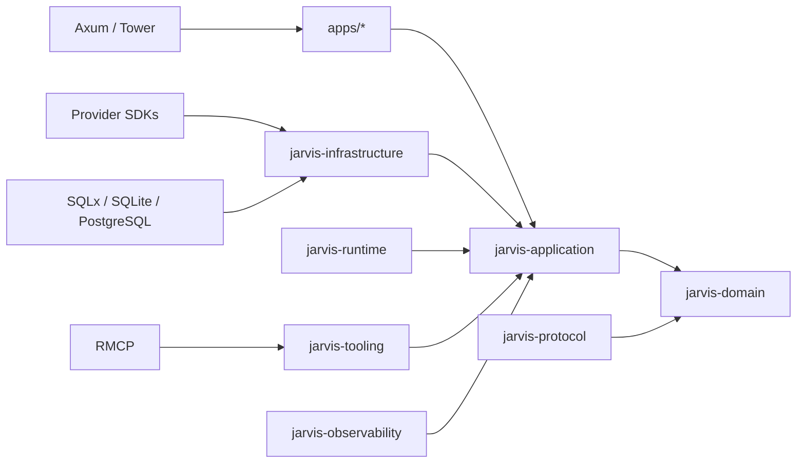

# Domain Boundaries and Repository Layout

Status: PROPOSED

## Dependency Rule

Domain policy points inward. Infrastructure implements ports defined by the
domain/application layers.



Arrows mean "depends on." The domain never imports adapters.

## Bootstrap Crates

Start with a small set and split only when ownership or compilation pressure is
real.

### `jarvis-domain`

Owns pure concepts and invariants:

- typed IDs, workspace/principal scope, time/value objects;
- run, tool, approval, memory, event, and workflow state enums;
- policy inputs/decisions and effect/risk classifications;
- domain errors and transition validation;
- no async runtime, HTTP, SQL, provider, or UI types.

### `jarvis-application`

Owns use cases and ports:

- command/query handlers and transaction boundaries;
- run/context/tool/workflow orchestration;
- repository, clock, ID, model, runtime, tool, event, secret, and audit ports;
- cancellation and request context;
- no concrete database or provider SDK.

### `jarvis-protocol`

Owns intentionally public, versioned wire contracts:

- HTTP/API DTOs and streamed activity events;
- runtime adapter messages;
- canonical tool and event envelopes;
- generated JSON Schema/OpenAPI inputs;
- compatibility and serialization fixtures.

It must not become a dump of internal domain structs. Public DTOs map explicitly
to application commands/results.

### `jarvis-infrastructure`

Initial adapter home for:

- SQLite/PostgreSQL repositories and migrations;
- config, paths, local keychain/secret stores, object files;
- HTTP clients, provider adapters, and webhook primitives;
- OS service and installer support libraries.

Split storage, connectors, or model providers into separate crates only when
feature flags, security review, compile time, or independent release ownership
requires it.

External adapter code lives in a manifest-mapped integration subtree, for
example `crates/jarvis-infrastructure/src/adapters/<kind>/<integration>/` or a
top-level `adapters/<kind>/<integration>/`. Do not hide provider-specific code in
a generic `providers.rs`, `client.rs`, or broad infrastructure module: the path
is part of evidence-gate enforcement and ownership review.

### `jarvis-runtime`

Owns native run execution and external runtime supervision/protocol adaptation.
It depends on application ports and public protocol contracts, not concrete
tools or databases.

### `jarvis-tooling`

Owns canonical tool registry/execution adapters, MCP host/server adaptation,
plugin manifests, and built-in tool implementations. Policy remains in the
domain/application layer.

### `jarvis-observability`

Owns tracing setup, redaction layers, metrics exporters, and diagnostics bundle
construction behind application audit/telemetry ports.

## Applications

```text
apps/
  jarvisd/          composition root and daemon lifecycle
  jarvis-cli/       thin local/remote API client plus offline repair
  jarvis-desktop/   later Tauri client
```

Application `main.rs` files parse launch options, construct adapters, start the
application, and map top-level exits. Business decisions do not live there.

## Bounded Contexts

| Context | Owns | Does not own |
| --- | --- | --- |
| Identity | principals, devices, sessions, workspaces, grants | provider OAuth token mechanics |
| Agent | runs, steps, plans, public activity, runtime selection | runtime-internal checkpoints |
| Models | normalized requests/events, capabilities, routing | user authorization |
| Tools | definitions, calls, effects, policy, approvals, outcomes | connector-specific API models |
| Memory | candidates, memories, entities, retrieval, correction | raw provider conversation stores |
| Automation | events, schedules, workflows, leases, retries | agent framework graph internals |
| Connectors | accounts, sync cursors, webhook ingress, provider health | canonical user memory |
| Voice | calls, voice sessions, provider callbacks, consent state | agent policy or canonical identity |
| Operations | config, health, diagnostics, backup, release state | product business decisions |

Cross-context operations use application services and typed IDs. They do not
reach into another context's tables or private modules.

## Ports

Ports should describe JARVIS needs, not vendor APIs. Representative examples:

```rust,ignore
trait ModelGateway;
trait AgentRuntime;
trait ToolCatalog;
trait ToolExecutor;
trait PolicyEvaluator;
trait ApprovalRepository;
trait MemoryRepository;
trait RunRepository;
trait WorkflowRepository;
trait EventPublisher;
trait SecretResolver;
trait AuditSink;
trait Clock;
trait IdGenerator;
```

Avoid one giant `Storage` or `Provider` trait. Keep transactional operations in a
purpose-built unit-of-work port when atomicity crosses repositories.

## Type Ownership

- Domain IDs and decisions are owned by `jarvis-domain`.
- Public wire schemas are owned by `jarvis-protocol`.
- SQL row structs are private to storage adapters.
- Provider request/response types are private to provider adapters.
- Tauri and TypeScript types are generated from public schemas where practical.
- MCP types are translated to canonical tool types at the MCP adapter boundary.

## Repository Growth Rules

Add a crate when at least one is true:

- it is a public SDK or independently versioned protocol;
- it enforces a security/process isolation boundary;
- feature selection must exclude heavyweight platform dependencies;
- it has a distinct owner and release lifecycle;
- compile/test time measurements show a meaningful gain.

Do not add a crate merely because a directory has several files. Do not use a
generic `common`, `shared`, or `utils` crate as a dependency escape hatch.