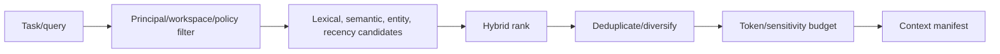

# Memory and Context Architecture

Status: PROPOSED

## Principle

Memory is a governed knowledge subsystem, not a transcript vector index.
Conversation history remains source material. Durable memory is an explicit,
typed claim with provenance, confidence, scope, validity, and correction.

## Memory Classes

| Class | Purpose | Default lifetime |
| --- | --- | --- |
| Working | Current plan, observations, pending questions | Run/task |
| Conversation | Relevant turn history and summaries | Session/retention policy |
| Episodic | Something that happened at a time | Durable with expiry policy |
| Semantic | A fact or belief about the user's world | Durable, correctable |
| Preference | How the user wants outcomes or interactions | Durable, user-controlled |
| Relationship | Links among people, organizations, projects, accounts | Durable, confidence-based |
| Procedural | How a repeatable task should be performed | Durable, versioned |

Working memory belongs to run state and is not automatically promoted.

## Durable Memory Record

Required fields include:

```text
memory_id
workspace_id
subject/principal scope
type and typed payload version
canonical content and optional display text
source kind, source ID, source timestamp
confidence and importance
sensitivity and policy labels
valid_from, valid_until
created_at, updated_at, last_accessed_at
supersedes / contradicted_by / derived_from
embedding model/version/vector reference
entity links
write actor and confirmation state
```

The source payload may have a shorter retention period than the derived memory;
the memory must still retain enough provenance to explain its origin or state
that the source was deleted.

## Write Pipeline


Candidate extraction can use a model, but deterministic policy controls whether
the candidate may be stored. Sensitive traits, credentials, health, legal,
financial, identity, and third-party claims require stricter policy and often
explicit confirmation.

The initial implementation stores only explicit user requests such as
"remember that..." and confirmed preferences. Automatic extraction follows
after inspection/correction UX is proven.

## Deduplication and Contradiction

Do not overwrite an old memory in place when history matters.

- Exact normalized duplicates reinforce source/confidence metadata.
- Compatible details may merge into a new revision with both sources.
- Contradictions create a candidate supersession or unresolved conflict.
- Time-bounded facts coexist when validity intervals do not overlap.
- Low-confidence entity matches remain separate candidates.

The user can inspect why JARVIS currently believes a value and restore a prior
revision where retention permits.

## Retrieval Pipeline



Authorization and sensitivity filters happen in candidate queries, before
ranking. Post-filtering a global nearest-neighbor result leaks both recall and
potential side channels.

A configurable rank can combine:

```text
score = semantic_similarity
      + lexical_relevance
      + entity_relevance
      + recency_decay
      + importance
      + source_reliability
      + task_relevance
      - contradiction_penalty
```

Weights are versioned and evaluated. Semantic similarity alone is never the
entire retrieval policy.

## Context Manifest

Every model/runtime context build records a manifest containing:

- run, call, principal, and workspace IDs;
- context policy/version and total budget;
- included item references, source, sensitivity, and token estimate;
- reason and score components for inclusion;
- exclusions/truncation summaries;
- generated summaries and their source ranges;
- tool catalog projection and capability reasons.

The manifest enables diagnosis without storing duplicate prompt text. Access to
the referenced content still follows current authorization and retention rules.

### Implemented evidence: context budgeting and the manifest (`BRN-006`)

`jarvis_domain::context` implements the retrieval pipeline's second half as types.
`ContextBudget::assemble` is the pipeline, and the step order is the rule it
enforces:

1. **Policy and scope filtering precede ranking.** A candidate whose sensitivity
   exceeds the call's ceiling, or whose validity has passed, is refused *before* it
   is scored — the architecture requires this because "post-filtering a global
   nearest-neighbor result leaks both recall and potential side channels". A refused
   candidate is **counted by reason**, never silently dropped.
2. **Deduplication follows ranking**, so the highest-ranked occurrence of a
   reference is the one kept rather than whichever came first in the caller's list.
3. **Ranking is a total order** — priority band, then score, then recency, then
   reference — so the same candidate set assembles identically regardless of input
   order.
4. **An item that does not fit is excluded, never truncated**, because a
   half-truncated message reads as a complete one to the model.
5. **The manifest is built from what happened**, carrying each inclusion's
   reference, source, sensitivity, token estimate, reason, and score, plus an
   exclusion summary counted by reason.

Three properties are structural:

- **A zero-cost candidate is refused** (`ContextCandidate::validated`), because it is
  the one way content could enter the context without consuming budget.
- **A non-finite score is refused**, because a `NaN` makes the ranking comparator's
  order undefined, so the same set could assemble differently on two runs.
- **Hidden reasoning is inexpressible, not filtered.** `CandidateSource` has no
  variant for model-internal reasoning, so `FR-RUN-005` holds by construction, and a
  serialized-shape test asserts the manifest has no field that could carry it.

`ContextManifest::is_consistent` checks its own arithmetic — included plus excluded
equals offered, the used tokens equal the included items' sum, and the used total
never exceeds the budget — because a manifest failing any of those describes a
decision the code could not have made, which is a corruption signal rather than a
display problem.

**Not done**: this is candidate selection and budgeting only. Nothing retrieves
candidates yet — lexical and semantic retrieval, the hybrid score's components, and
entity resolution are Milestone 4 (`MEM-003`, `MEM-004`, `MEM-005`, `MEM-006`), so
the `score` a caller supplies is a value JARVIS does not yet compute. Summarization
and compaction are `MEM-008`; the manifest is not persisted, because the
`context_manifests` and `context_manifest_items` tables are not created; and the
delimiting of untrusted content that the source-priority section requires is exposed
by `CandidateSource::is_untrusted` but consumed by nothing yet, since no prompt is
assembled before `BRN-007`.

## Context Source Priority

Typical order:

1. immutable system safety and product policy;
2. authenticated workspace/user policy and active task;
3. current conversation turns and pending state;
4. relevant confirmed memories;
5. relevant documents/entities/events;
6. tool observations and runtime-specific context;
7. optional style preferences.

Untrusted retrieved content is clearly delimited and never placed where a model
could confuse it with system policy.

## Summarization and Compaction

- Keep raw source references and summary version.
- Summaries are replaceable derived artifacts, not authoritative facts.
- Preserve unresolved commitments, approvals, tool call/result pairing, user
  corrections, and safety constraints.
- Never summarize away a waiting state or side-effect ambiguity.
- Recompaction must be deterministic enough to preserve replay invariants even
  when wording changes.

## Entity Resolution

Canonical entity types start with person, organization, project, account,
document, device, location, event, and task. An alias/external identifier is
scoped by provider and workspace.

Merges require evidence and confidence. High-impact merges require confirmation.
Every merge is reversible through lineage; external identifiers are not silently
moved between unrelated workspaces.

## Privacy Controls

Users can:

- disable all durable memory or selected classes;
- see candidates awaiting confirmation;
- inspect source and confidence;
- correct, supersede, archive, or hard-delete;
- set retention and sensitive-memory policy;
- export memories and lineage in a portable format.

Memory used for proactive behavior needs an additional policy check at use time.
A fact being remembered does not authorize contacting a person or taking action.

## Evaluation

Test with a versioned evaluation corpus covering:

- relevant retrieval and useful omission;
- false memory insertion;
- duplicate and contradictory claims;
- expired or superseded facts;
- entity false merges;
- prompt injection in sources;
- cross-workspace isolation;
- deletion and correction propagation;
- context budget overflow;
- explanation/provenance accuracy.

Track retrieval quality separately from final model answer quality.