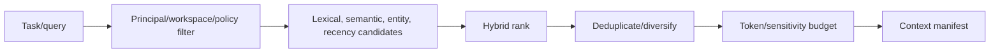

# Memory and Context Architecture

Status: PROPOSED

## Principle

Memory is a governed knowledge subsystem, not a transcript vector index.
Conversation history remains source material. Durable memory is an explicit,
typed claim with provenance, confidence, scope, validity, and correction.

## Memory Classes

| Class | Purpose | Default lifetime |
| --- | --- | --- |
| Working | Current plan, observations, pending questions | Run/task |
| Conversation | Relevant turn history and summaries | Session/retention policy |
| Episodic | Something that happened at a time | Durable with expiry policy |
| Semantic | A fact or belief about the user's world | Durable, correctable |
| Preference | How the user wants outcomes or interactions | Durable, user-controlled |
| Relationship | Links among people, organizations, projects, accounts | Durable, confidence-based |
| Procedural | How a repeatable task should be performed | Durable, versioned |

Working memory belongs to run state and is not automatically promoted.

## Durable Memory Record

Required fields include:

```text
memory_id
workspace_id
subject/principal scope
type and typed payload version
canonical content and optional display text
source kind, source ID, source timestamp
confidence and importance
sensitivity and policy labels
valid_from, valid_until
created_at, updated_at, last_accessed_at
supersedes / contradicted_by / derived_from
embedding model/version/vector reference
entity links
write actor and confirmation state
```

The source payload may have a shorter retention period than the derived memory;
the memory must still retain enough provenance to explain its origin or state
that the source was deleted.

## Write Pipeline


```mermaid
flowchart LR
    Experience[Conversation/event/tool result]
    Extract[Candidate extraction]
    Classify[Type, scope, sensitivity]
    Validate[Grounding and confidence]
    Resolve[Deduplicate/entity resolve]
    Consent[Confirmation if required]
    Commit[Commit memory + provenance]
    Review[Reinforce/correct/expire/forget]

    Experience --> Extract --> Classify --> Validate --> Resolve --> Consent --> Commit --> Review
```

Candidate extraction can use a model, but deterministic policy controls whether
the candidate may be stored. Sensitive traits, credentials, health, legal,
financial, identity, and third-party claims require stricter policy and often
explicit confirmation.

The initial implementation stores only explicit user requests such as
"remember that..." and confirmed preferences. Automatic extraction follows
after inspection/correction UX is proven.

## Deduplication and Contradiction

Do not overwrite an old memory in place when history matters.

- Exact normalized duplicates reinforce source/confidence metadata.
- Compatible details may merge into a new revision with both sources.
- Contradictions create a candidate supersession or unresolved conflict.
- Time-bounded facts coexist when validity intervals do not overlap.
- Low-confidence entity matches remain separate candidates.

The user can inspect why JARVIS currently believes a value and restore a prior
revision where retention permits.

## Retrieval Pipeline


```mermaid
flowchart LR
    Query[Task/query]
    Scope[Principal/workspace/policy filter]
    Candidates[Lexical, semantic, entity, recency candidates]
    Rank[Hybrid rank]
    Diversify[Deduplicate/diversify]
    Budget[Token/sensitivity budget]
    Manifest[Context manifest]

    Query --> Scope --> Candidates --> Rank --> Diversify --> Budget --> Manifest
```

Authorization and sensitivity filters happen in candidate queries, before
ranking. Post-filtering a global nearest-neighbor result leaks both recall and
potential side channels.

A configurable rank can combine:

```text
score = semantic_similarity
      + lexical_relevance
      + entity_relevance
      + recency_decay
      + importance
      + source_reliability
      + task_relevance
      - contradiction_penalty
```

Weights are versioned and evaluated. Semantic similarity alone is never the
entire retrieval policy.

## Context Manifest

Every model/runtime context build records a manifest containing:

- run, call, principal, and workspace IDs;
- context policy/version and total budget;
- included item references, source, sensitivity, and token estimate;
- reason and score components for inclusion;
- exclusions/truncation summaries;
- generated summaries and their source ranges;
- tool catalog projection and capability reasons.

The manifest enables diagnosis without storing duplicate prompt text. Access to
the referenced content still follows current authorization and retention rules.

### Implemented evidence: context budgeting and the manifest (`BRN-006`)

`jarvis_domain::context` implements the retrieval pipeline's second half as types.
`ContextBudget::assemble` is the pipeline, and the step order is the rule it
enforces:

1. **Policy and scope filtering precede ranking.** A candidate whose sensitivity
   exceeds the call's ceiling, or whose validity has passed, is refused *before* it
   is scored — the architecture requires this because "post-filtering a global
   nearest-neighbor result leaks both recall and potential side channels". A refused
   candidate is **counted by reason**, never silently dropped.
2. **Deduplication follows ranking**, so the highest-ranked occurrence of a
   reference is the one kept rather than whichever came first in the caller's list.
3. **Ranking is a total order** — priority band, then score, then recency, then
   reference — so the same candidate set assembles identically regardless of input
   order.
4. **An item that does not fit is excluded, never truncated**, because a
   half-truncated message reads as a complete one to the model.
5. **The manifest is built from what happened**, carrying each inclusion's
   reference, source, sensitivity, token estimate, reason, and score, plus an
   exclusion summary counted by reason.

Three properties are structural:

- **A zero-cost candidate is refused** (`ContextCandidate::validated`), because it is
  the one way content could enter the context without consuming budget.
- **A non-finite score is refused**, because a `NaN` makes the ranking comparator's
  order undefined, so the same set could assemble differently on two runs.
- **Hidden reasoning is inexpressible, not filtered.** `CandidateSource` has no
  variant for model-internal reasoning, so `FR-RUN-005` holds by construction, and a
  serialized-shape test asserts the manifest has no field that could carry it.

`ContextManifest::is_consistent` checks its own arithmetic — included plus excluded
equals offered, the used tokens equal the included items' sum, and the used total
never exceeds the budget — because a manifest failing any of those describes a
decision the code could not have made, which is a corruption signal rather than a
display problem.

**Not done**: this is candidate selection and budgeting only. Nothing retrieves
candidates yet — lexical and semantic retrieval, the hybrid score's components, and
entity resolution are Milestone 4 (`MEM-003`, `MEM-004`, `MEM-005`, `MEM-006`), so
the `score` a caller supplies is a value JARVIS does not yet compute. Summarization
and compaction are `MEM-008`; the manifest is not persisted, because the
`context_manifests` and `context_manifest_items` tables are not created; and the
delimiting of untrusted content that the source-priority section requires is exposed
by `CandidateSource::is_untrusted` but consumed by nothing yet, since no prompt is
assembled before `BRN-007`.

### Implemented evidence: the first memory slice (`MEM-001`, `MEM-002`, `MEM-003`)

Added 2026-10-03. What exists is exactly what "the initial implementation stores only explicit user requests"
describes, and the types make the restriction structural rather than a policy:

- `jarvis_domain::memory` — `MemoryId`, `MemoryText` (trimmed, bounded to 2,048 bytes, no control characters,
  with a normalized dedupe key), `MemoryClass` (`preference` and `semantic` only), `Memory`, and
  `MemorySource`, which has **one** variant, `UserRequest { principal }`. There is no inferred or extracted
  source, so a model-proposed claim has no way to become a memory through this type.
- `000013_memories.sql` — one table, `workspace_id` on every row, a unique `(workspace_id, dedupe_key)` index,
  and `CHECK` constraints on the class and the source kind, so even a buggy writer cannot store a source this
  build does not define. Schema version 13.
- `SqliteMemoryRepository` — `workspace_id` is in every statement, so a foreign memory is absent rather than
  forbidden; an exact duplicate is one `INSERT ... ON CONFLICT DO NOTHING` whose result decides, not a prior
  read; forgetting is a **hard delete**, so the text is removed rather than tombstoned.
- Retrieval is **lexical and deterministic**: `lexical_relevance` is the fraction of the query's distinct tokens
  found (exact, or a shared prefix of at least four characters), computed in Rust over the newest 1,000
  memories of the workspace, ordered by relevance, then recency, then identity. A search reports
  `scan_bounded` when more memories existed than it considered.
- `MemoryService` and `/api/v1/memories` (see the local control API contract) — remember, list, search, read,
  and forget. The workspace and principal come from the authenticated context, never the body.
- **Recall.** `RunController::build_context` searches the run's workspace with the objective (at most five
  hits) and offers each hit to `context_assembly::assemble_with_memories`. A recalled memory competes under the
  same budget and the same **sensitivity ceiling before ranking** as every other candidate: a memory labelled
  above the run's data-policy ceiling is counted as a `sensitivity` exclusion and never reaches the provider.
  Memories sit in the domain's memory band, below the conversation, so they cannot crowd out the turns an
  answer is about. They render ahead of the conversation, with the objective last, labelled "remembered
  earlier by the user, in their own words" — deliberately **not** the "untrusted data" wording other memory
  sources would get, because the only writer is the user and that wording would stop the model honouring the
  preference. When automatic extraction arrives, that label must key off the memory's source. Recall is best
  effort: an unreachable store leaves the run to be answered from the conversation alone.
- `jarvis memory remember|list|search|show|forget` is a thin client over the same API.

Evidence: 7 domain tests; 9 repository tests against a real database, including identical text in two
workspaces never crossing, the ranking order, a hard delete that removes the text, corruption reported as
corruption, and the database refusing a source or class this build does not write; 3 API journey tests; 5
assembly tests; and `tests/memory_recall.rs`, which starts a **real daemon**, remembers through the API, asks
two questions against a fake OpenAI-compatible server, and asserts from the **wire request** that the matching
question carried the memory (before the question, labelled) and the unrelated one did not — then restarts the
daemon and recalls it again, then forgets it and shows a third daemon no longer sends it. Falsified by making
recall search for an empty query (the journey fails) and by removing the workspace filter from the newest-first
query (the isolation test fails).

**Not done, and named:** correction and supersession lineage, export, a per-workspace disable switch
(`ACC-031`'s "disable memory"), the other five memory classes and their lifecycle rules (`MEM-010`), embeddings
and hybrid ranking (`MEM-004`/`MEM-005`), entity resolution (`MEM-006`), a persisted context manifest or ledger
for recalled memories (`MEM-008` — the manifest is built per run but not stored), validity windows and expiry,
inferred or sensitive-claim confirmation, and a full-text index (the search scans the newest 1,000 rows).
`ACC-030` is evidenced for a preference remembered through the API; `ACC-032` at the store and recall level;
`ACC-031`, `ACC-033`, `ACC-034`, `ACC-035`, and `ACC-036` are not.

## Context Source Priority

Typical order:

1. immutable system safety and product policy;
2. authenticated workspace/user policy and active task;
3. current conversation turns and pending state;
4. relevant confirmed memories;
5. relevant documents/entities/events;
6. tool observations and runtime-specific context;
7. optional style preferences.

Untrusted retrieved content is clearly delimited and never placed where a model
could confuse it with system policy.

## Procedural Memory and Learned Skills

Procedural memory is the class this architecture names for "how a repeatable task
should be performed", and it is the class with the least implementation. A
procedure is not a sentence about the world the way a semantic memory is; it is an
ordered method that composes tools. Its durable form is a **skill**
([skill-contract.md](../contracts/skill-contract.md)), and its decision is
[ADR-0012](../adr/0012-governed-learning-loop.md).

Three rules connect procedural memory to the rest of this subsystem:

- **A learned procedure is a memory *and* a set of tool references.** It carries the
  same provenance every durable memory carries — source run, confidence, scope,
  validity, sensitivity, and supersession lineage — and additionally names the
  tools it uses. The tools are referenced by canonical identity and schema
  fingerprint; the procedure never embeds a tool implementation or a grant.
- **Promotion is a candidate→commit pipeline, not an in-place edit.** The extraction
  stage that can use a model produces *candidates*; deterministic policy decides
  whether a candidate may be written, exactly as the write pipeline above requires.
  A sensitive procedure requires confirmation. Nothing is written by a model
  deciding to write it.
- **The review that proposes candidates is durable work, not a chat side effect.** It
  is a persisted, budgeted, resumable workflow run
  ([workflows-events.md](workflows-events.md)), so an interrupted review resumes
  rather than being lost, and it is bounded by a cumulative replayed-input-token
  budget so learning cannot become a silent, unbounded cost center.

**Working memory is never promoted automatically**, and this rule extends to
procedures: a procedure observed during a run becomes durable only through the
pipeline, and the run's own working state is discarded with the run.

The learned set is inspectable, correctable, revocable, and exportable under
`FR-MEM-003`, and a revoked procedure is absent from the index for new runs
without altering a run that already completed. Context assembly sees a learned
skill as one more candidate whose inclusion is recorded in the manifest with its
reason and token estimate — which is why progressive skill loading (index, body,
reference) is a manifest concern rather than a prompt-editing concern.

## Summarization and Compaction

- Keep raw source references and summary version.
- Summaries are replaceable derived artifacts, not authoritative facts.
- Preserve unresolved commitments, approvals, tool call/result pairing, user
  corrections, and safety constraints.
- Never summarize away a waiting state or side-effect ambiguity.
- Recompaction must be deterministic enough to preserve replay invariants even
  when wording changes.

## Entity Resolution

Canonical entity types start with person, organization, project, account,
document, device, location, event, and task. An alias/external identifier is
scoped by provider and workspace.

Merges require evidence and confidence. High-impact merges require confirmation.
Every merge is reversible through lineage; external identifiers are not silently
moved between unrelated workspaces.

## Privacy Controls

Users can:

- disable all durable memory or selected classes;
- see candidates awaiting confirmation;
- inspect source and confidence;
- correct, supersede, archive, or hard-delete;
- set retention and sensitive-memory policy;
- export memories and lineage in a portable format.

Memory used for proactive behavior needs an additional policy check at use time.
A fact being remembered does not authorize contacting a person or taking action.

## Evaluation

Test with a versioned evaluation corpus covering:

- relevant retrieval and useful omission;
- false memory insertion;
- duplicate and contradictory claims;
- expired or superseded facts;
- entity false merges;
- prompt injection in sources;
- cross-workspace isolation;
- deletion and correction propagation;
- context budget overflow;
- explanation/provenance accuracy.

Track retrieval quality separately from final model answer quality.