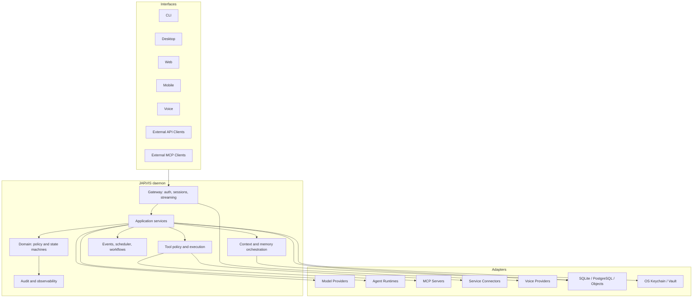
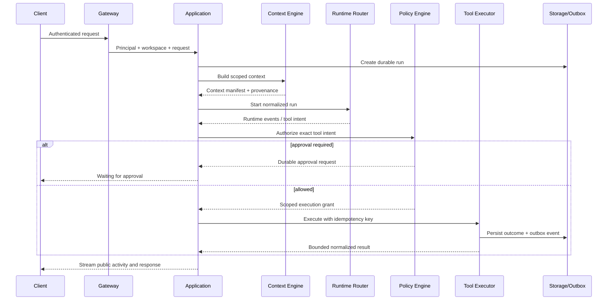

# System Architecture

Status: PROPOSED

## Summary

JARVIS is a local-first daemon with a hexagonal architecture. Rust owns durable
state, policy, orchestration, and public contracts. Interfaces, providers,
runtimes, tools, databases, and voice systems connect through ports and adapters.

## Control Plane and Data Plane

The distinction is about authority, not deployment location.

### Control Plane

JARVIS owns:

- principal, device, session, and workspace identity;
- context selection and memory lifecycle;
- run, task, workflow, and approval state;
- model/runtime/tool routing;
- policy, risk, permission, budget, and consent decisions;
- connector and plugin grants;
- audit history and externally visible status.

### Data Plane

Replaceable adapters perform:

- model inference and embeddings;
- external agent strategies;
- MCP transport and remote tool execution;
- provider API calls and webhook delivery;
- audio transport, STT, TTS, and telephony;
- database, object, cache, and secret persistence.

A data-plane component may report facts and capabilities. It cannot grant itself
authority or become the canonical source for JARVIS identity, memory, policy, or
workflow completion.

## Request Path

## Trust Boundaries

| Boundary | Untrusted side | Required controls |
| --- | --- | --- |
| Client to gateway | Caller, device, browser, voice metadata | Authentication, origin/host validation, rate limit, workspace resolution |
| Model to core | Text, tool calls, structured output | Schema validation, policy, no ambient credentials |
| Runtime to core | Events, artifacts, completion claims | Version negotiation, process isolation, quotas, reconciliation |
| MCP to tool fabric | Tools, metadata, content, prompts | Server identity, allowlist, schema validation, invocation-time auth |
| Connector to provider | Remote API and webhooks | OAuth scope, signature/replay checks, retries, normalization |
| UI to daemon | Compromised webview or browser | Generated API, CSP, scoped token/capability, no secret API |
| Storage | Corrupt, old, or attacker-modified state | Migrations, constraints, integrity checks, encryption profile, audit |

## Deployment Profiles

### Local

One `jarvisd` process, SQLite, local files, and OS keychain. The daemon serves a
loopback API and optional bundled web assets. External runtimes and MCP servers
are child processes or explicitly configured remote services.

### Personal Server

One or more daemon/worker processes, PostgreSQL, object storage, and a secret
manager. Clients authenticate remotely over TLS. A single-node deployment must
work before horizontal workers are introduced.

### Team

Adds organization/workspace administration, service clients, RBAC/capabilities,
quotas, audit export, retention, and stronger deployment controls. Team mode is
not a flag that weakens local assumptions; it is a distinct security profile.

## Failure Domains

- A client disconnect must not silently cancel a durable run.
- A model provider failure may fail or reroute a model call, not corrupt state.
- A runtime crash fails or suspends its run, not the daemon.
- A connector outage degrades that connector and queues only policy-safe work.
- An MCP server hang is bounded by timeout/cancellation and process supervision.
- Storage write failure prevents success publication.
- Observability failure must not block core work indefinitely or leak payloads.
- Voice transport loss terminates or suspends the call session according to an
  explicit state transition; it does not infer user intent.

## Architectural Fitness Functions

CI should eventually enforce:

- domain crates have no infrastructure dependencies;
- public schemas round-trip and remain backwards compatible within a major;
- every tool route passes one policy/execution facade;
- every durable event has an outbox transaction path;
- every workspace-owned repository method requires workspace scope;
- logs and diagnostics redact seeded secrets;
- external adapters have evidence notes and contract tests;
- packaged clean-install tests pass per supported operating system.