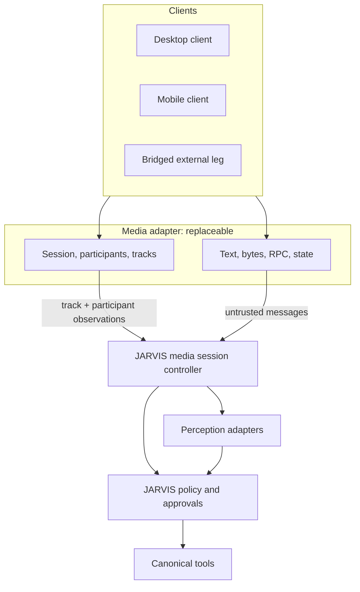

# Realtime Media Sessions

Status: PROPOSED
Last source review: 2026-09-21

## Principle

A realtime media session is a **transport and perception channel into JARVIS**. It
does not own canonical identity, memory, policy, tools, or reasoning. Sessions,
participants, tracks, captured pixels and audio, and the data messages carried
alongside them are untrusted observations, exactly like a provider webhook or a
retrieved document.

[Voice and telephony](voice-telephony.md) defines the *call* shape: a carrier,
audio pipeline, and turn-taking model. This document defines the *media session*
shape that a call may ride on and that a desktop or mobile client may open
without any telephony leg at all. The two are separate choices, and a call is one
participant configuration inside a media session rather than a distinct concept.

## Transport Is Not Understanding

Four capabilities are routinely conflated in realtime-agent products. They are
four different systems, and only one of them is JARVIS's.

| Layer | What it does | Owned by |
| --- | --- | --- |
| **Transport** | Carries audio, video, screen, and data between participants: rooms, tracks, subscription, reconnection | replaceable adapter |
| **Perception** | Interprets what was carried: speech recognition, image/video understanding, screen interpretation | replaceable model, under policy |
| **Decisions** | Decides what may be done about it: context, policy, approval, budget | **JARVIS** |
| **Effects** | Performs the action: a canonical tool with an idempotency key and an outcome record | **JARVIS** |

Two rules follow, and they are the reason this document exists:

- **Sharing a screen is not granting understanding, and understanding a screen is
  not authorization to act on it.** A transport that delivers a screen share has
  done nothing but deliver pixels. An operator who reads this document must be
  able to say which of the four layers a given capability belongs to, because a
  failure at one layer is diagnosed completely differently from a failure at
  another.
- **A capability that arrives over a media transport is still a capability.** A
  participant asking another participant to run a method, or sending a message
  that names an action, is proposing an effect. It is policy input, never policy.

## Media Session Model

A session is the durable JARVIS record. A room, a channel, or a connection is an
adapter's name for the same thing and never appears in JARVIS state.

| JARVIS concept | Meaning | Authority |
| --- | --- | --- |
| **Media session** | A durable, workspace-scoped container opened for a purpose | Owned by JARVIS; adapter binding is opaque |
| **Participant** | A client, agent, or bridged external leg joined to a session | Scoped reference only; never canonical identity |
| **Track** | One media stream a participant publishes or subscribes to, by kind and role | Subject to a grant at admission *and* at publication |
| **Grant** | JARVIS-issued permission to publish or subscribe a specific track kind/role in a session | Issued per session, expiring, revocable |
| **Capture** | Local acquisition of microphone, camera, screen, or screen/tab audio | Opt-in per session with a visible indicator |

Canonical state lives in JARVIS. The session record, its lifecycle, its grants,
and its terminal reconciliation follow
[the media session contract](../contracts/media-session.md).

## Data Plane Is Policy Input

A media transport carries more than audio. The data surfaces are documented per
adapter, and each has properties JARVIS must not assume away:

- **Guaranteed, message-based surfaces** (text streams, byte streams, and
  request/response calls between participants) are chunked and topic- or
  method-routed, and concurrent streams are handled in the order the sender opened
  them. They are still unbounded untrusted input: topic, size, and sender are
  adapter observations, not JARVIS authorization.
- **Lossy, continuous surfaces** (data tracks for telemetry and sensor streams)
  drop frames by design. A dropped frame is not a gap to reconcile and not an
  error; treating it as either is a defect.
- **State synchronization surfaces** (participant attributes and room metadata)
  are broadcast to every participant and are provider-writable. They are
  **never** an authorization input, a workspace selector, or a secret store.
- **Request/response calls are the sharp edge.** They let one participant execute
  a method on another, which is a function-call-shaped primitive delivered by an
  untrusted peer. Such a call must be mediated the way any other proposed effect
  is: the receiving side is JARVIS or a JARVIS-governed client, the method set is
  fixed and non-extensible by a peer, arguments are schema-validated, and the
  result cannot itself carry authority. Framework documentation that suggests
  forwarding model tool calls this way is describing a bypass, not a feature.

**Nothing a transport carries becomes a JARVIS tool by arriving.** There is one
canonical tool path, and a message over a media session reaches it only by
producing a policy-evaluated tool intent.

## Capture Consent

Live capture changes what the machine is observing, so it is gated separately
from the session itself:

- microphone, camera, screen, and screen-audio capture are **off by default** and
  enabled per session by an explicit user action;
- a capture state that a user cannot see is a defect, not a convenience;
- revocation stops publishing immediately and is recorded on the session;
- a screen or camera grant is not a grant to *understand* it, and understanding is
  not a grant to act on it;
- browser or platform capture limitations are stated, not hidden: some platforms
  and browsers cannot capture tab audio, and a user who believes audio is shared
  when it is not has been misled by the product.

## Authority and Grants

- Admission to a session requires a JARVIS-issued credential bound to principal,
  workspace, session, expiry, and role. Transport-issued tokens are derived from
  that credential, never the reverse.
- Publish and subscribe are authorized **at track granularity**, and the check is
  repeated at publication time, not only at admission.
- A transport's own permission model (roles, mute, subscription controls,
  attribute flags) is defense in depth. It is not JARVIS authorization, and no
  JARVIS decision may depend on the transport having enforced something.
- Participant identity, display name, attributes, and metadata are untrusted
  claims. A workspace is resolved server-side from the JARVIS credential.
- An agent participant receives the same treatment as a human one: a scoped
  grant, not ambient authority.

## Connection Lifecycle

Realtime transports connect in phases, and the phases do not mean the same thing.
A control/signalling phase can succeed while the media phase fails, leaving a
participant that is "connected" and unable to send or receive anything.

- Model the phases explicitly. A participant that has signalled is not a
  participant that can carry media, and the contract must not conflate them.
- A degraded network reported by the transport is an observation that may precede
  a disconnect; it feeds session state rather than being inferred from a timeout.
- Reconnection is an adapter capability with its own semantics. Where it is
  supported, it resumes the session; where it is not, a disconnect is an
  observation and not a completion.
- Session termination is an explicit transition with a recorded reason. A missing
  participant is not a terminated session.

## Failure Domains

- A participant disconnect does not end a durable JARVIS session or its run.
- A transport outage suspends media for that session and leaves canonical state
  and every other interface usable.
- A perception adapter failure degrades interpretation, never authorization.
- A media adapter failure must not corrupt session state or block non-media work.
- Recording, export, and external ingestion are separately gated side effects;
  each must be able to fail without affecting the live session.
- A media session must be usable with the adapter removed: JARVIS canonical
  session records, policy, tools, and the CLI stay intact.

## Provider Neutrality

**A realtime media platform is a transport, not an architecture.** A platform that
also offers agent orchestration, turn detection, tools, handoffs, and per-stage
fallback overlaps capabilities JARVIS owns. Where such a platform is adopted:

- it is adopted behind the [runtime protocol](../contracts/runtime-protocol.md)
  as an external runtime and/or as a replaceable media adapter per
  [ADR-0005](../adr/0005-isolated-external-runtimes.md);
- it receives scoped grants, never ambient credentials;
- its session, participant, and checkpoint state is adapter state, not canonical
  session state;
- its tools, MCP wiring, tasks, and handoffs must never become the JARVIS
  implementation, for the reason [ADR-0007](../adr/0007-voice-as-interface.md)
  records.

The transport decision and the agent-framework decision are **separate decisions
on separate axes** and must not be merged into one review. Evidence for the
current candidate platform, including its self-hosting prerequisites and its
unverified claims, is recorded in
[the LiveKit evidence note](../research/integrations/livekit.md).

## Operator Visibility

A media session that operators cannot diagnose is incomplete. Required:

- session state, participants, granted tracks, and capture state, with no
  credentials and no media payloads;
- per-stage timing kept separate — transport connect, capture, perception,
  context, model, tool wait, and first output;
- counters for dropped frames, reconnects, denied grants, and rejected messages;
- an explicit record of which layer (transport, perception, decision, effect)
  a failure occurred at.

## Acceptance Tests

- A participant cannot publish or subscribe a track that its grant does not name,
  at admission or later.
- A peer-supplied identity, attribute, or metadata value cannot select a workspace
  or grant a capability.
- A participant-to-participant method call cannot reach an unregistered method,
  cannot execute a tool without policy, and cannot return authority to the caller.
- Capture is off by default, visible while active, and stops publishing when
  revoked.
- Session records survive adapter removal and appear identically through CLI and
  client surfaces.
- Lossy surfaces drop frames without producing reconciliation errors; guaranteed
  surfaces deliver in order and are bounded.
