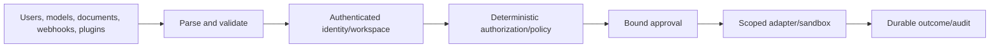

# Security Architecture

Status: PROPOSED

## Security Model

JARVIS combines private data, external communication, code execution, physical
systems, and nondeterministic models. The model is an untrusted planner inside a
deterministic reference monitor.

No instruction, tool description, document, or model output can skip this path.

## Assets

- user identity and workspace isolation;
- credentials, refresh tokens, signing keys, and session tokens;
- private conversations, memory, files, mail, calendar, and call data;
- approval intent and action integrity;
- runtime/tool execution authority;
- workflow state, schedules, and proactive rules;
- audit history and software update trust;
- availability and cost/spend budgets.

## Adversaries and Failure Sources

- malicious remote caller/client;
- compromised browser/webview/device;
- prompt-injected email, page, document, memory, or tool output;
- malicious or compromised MCP server/plugin/runtime;
- model error or adversarial model output;
- credential theft and OAuth consent abuse;
- webhook spoof/replay and SSRF;
- cross-workspace query/cache bugs;
- supply-chain or update compromise;
- operator mistake and corrupt/stale persisted state.

## Reference Monitor

The authorization/policy service must be:

- always invoked for protected operations;
- tamper-resistant relative to untrusted adapters;
- small and independently testable;
- based on trusted identity and canonical resource metadata;
- fail-closed on unknown tool source, effect, scope, or policy version;
- able to produce a safe explanation and durable decision record.

Policy caches are keyed by all relevant context and invalidated on grant/policy
changes. High-risk operations can require fresh evaluation and step-up auth.

## Prompt Injection

Treat external content as quoted data with provenance. Controls include:

- separate system policy from untrusted context structurally;
- minimize tools and data exposed per task;
- classify tool effects independently of descriptions;
- never follow document instructions to reveal secrets or alter policy;
- require authorization and approval regardless of model confidence;
- carry taint/provenance from untrusted content into tool-intent audit;
- detect suspicious instructions as a signal, not a sole security boundary;
- sanitize rendered HTML/Markdown and isolate MCP Apps/web content.

Prompt filters can reduce risk but cannot replace deterministic controls.

## Secret Architecture

Normal records store `SecretRef`, metadata, and owner, never plaintext values.
Resolvers support OS keychain in local mode and environment/Vault/cloud secret
managers in server mode.

Rules:

- resolve only in the adapter that needs the secret;
- use scoped credentials and minimum provider scopes;
- never return secret values through application APIs;
- zeroize where practical and minimize copies/lifetime;
- redact exact values and recognizable credential forms;
- prevent environment inheritance into child runtimes/plugins;
- rotate and revoke with connector/runtime health updates;
- do not store signing/update keys on ordinary developer machines or CI logs.

## Network Security and SSRF

- Separate configured provider endpoints from model-controlled URLs.
- Parse URLs structurally and allow only supported schemes.
- Resolve and block loopback, link-local, metadata, private, and rebinding targets
  unless an explicit local connector policy grants them.
- Pin redirect policy and revalidate every redirect target.
- Bound response size/time and disable ambient proxy/cookie behavior unless
  configured.
- Give sandboxes/plugins deny-by-default egress with audited allow rules.
- Webhook callback/redirect URLs are generated from trusted deployment config.

## Filesystem and Execution

- Canonicalize paths and defend against traversal, symlink/junction/reparse-point
  races, alternate data streams, reserved names, and case differences.
- File grants are rooted and mode-specific: read, create, modify, delete.
- Use open-relative/no-follow primitives or helper process boundaries where
  platform support requires them.
- Shell/code execution uses isolated processes/containers/WASI with CPU, memory,
  process, file, output, network, and time limits.
- Command display and approval reflect the actual executable, args, cwd,
  environment grants, and network/filesystem profile.
- Never concatenate untrusted text into a shell command when structured process
  APIs can express it.

## OAuth and Webhooks

- Use state, PKCE, exact redirect matching, and nonce where protocol requires.
- Bind OAuth state to principal/workspace/connector and expire it.
- Serialize rotating refresh token updates.
- Verify webhook signatures over raw bytes, enforce skew/replay defense, and
  bind delivery to the configured connector account.
- Do not log authorization codes, tokens, signatures, or full headers.

## Local API Security

- Loopback binding is not authentication.
- Validate `Host` and browser `Origin`; avoid privileged cookie auth.
- Store local bearer material under owner-only ACLs.
- Do not put tokens in URLs or command-line arguments.
- Pair/enroll clients explicitly and support revocation.
- Disable remote bind unless server-mode auth/TLS config passes validation.

## Supply Chain and Updates

- Pin dependencies and verify lockfile/provenance.
- Enforce dependency vulnerability/license policy.
- Build native artifacts on controlled native CI runners.
- Generate SBOM and build provenance.
- Sign checksums/artifacts/update metadata with separated release keys.
- Verify before installation and use atomic activation/rollback.
- Treat plugin/runtime packages as untrusted and preserve publisher/provenance.

## Audit Integrity

Audit records capture actor, action, resource, policy/approval, request/run/tool
IDs, outcome, provider reference, and safe metadata. They do not contain secrets
or unnecessary payloads.

For higher-assurance server mode, chain or sign audit batches and export to an
append-oriented external sink. Local mode protects audit files/database through
OS permissions and integrity checks while remaining exportable by the owner.

## Security Testing

- threat-model abuse cases as executable tests where possible;
- property/fuzz tests for parsers, schemas, paths, event ordering, and redaction;
- seeded-secret canaries across logs/errors/traces/support bundles;
- authorization matrix and cross-workspace tests;
- prompt-injection corpora exercising tools and memory;
- sandbox escape/limit tests per OS;
- webhook/OAuth replay and SSRF tests;
- malicious MCP/plugin/runtime fixtures;
- installer/update signature, downgrade, rollback, and tamper tests;
- dependency and artifact scans in CI;
- independent review before team/production release.

The detailed threat model owns scenario IDs and mitigations. This architecture
defines the boundaries it must cover.