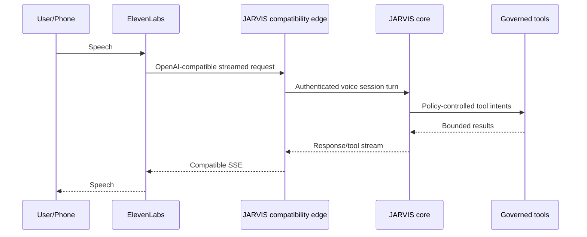
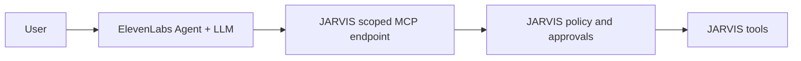

# Voice and Telephony Architecture

Status: PROPOSED
Last source review: 2026-09-20

## Principle

Voice is a channel into JARVIS. It does not own canonical identity, memory,
policy, tools, workflows, or reasoning. Every voice provider implements a
replaceable adapter over JARVIS call/session contracts.

## Voice Provider Port

The domain needs provider-neutral operations and events such as:

```rust,ignore
trait VoiceProvider {
    async fn start_outbound_call(
        &self,
        request: OutboundCallRequest,
    ) -> Result<ProviderCall, VoiceError>;

    async fn end_call(&self, call: CallId) -> Result<(), VoiceError>;
    async fn status(&self, call: CallId) -> Result<CallStatus, VoiceError>;
}
```

Realtime audio streaming may use a separate session/transport port. Provider
IDs and webhook payloads remain adapter details.

## ElevenLabs Mode A: JARVIS Is the Brain

This is the preferred personal JARVIS mode.



Current official ElevenLabs docs support custom LLM servers using either
`/v1/responses` or `/v1/chat/completions`, both streamed with SSE. JARVIS should
implement Responses first, then Chat Completions only for tested compatibility.

The compatibility edge must support currently documented ElevenLabs system-tool
function calls, including end, language switch, transfer, skip turn, and
voicemail behavior when configured. These calls alter call state through the
voice adapter; they do not become general JARVIS tools without policy metadata.

## ElevenLabs Mode B: ElevenLabs Agent Uses JARVIS MCP

An independently configured ElevenLabs agent may own its LLM while connecting
to JARVIS as a remote MCP server.



Use Streamable HTTP for new integrations. ElevenLabs currently documents both
SSE and Streamable HTTP MCP transports, but JARVIS should not add a legacy
transport unless live compatibility requires it.

ElevenLabs approval configuration is defense in depth. JARVIS policy remains
authoritative, especially for communication, destructive, code, financial,
privileged, and physical effects.

## Session Bootstrap and Identity

Do not trust phone number, caller ID, model-supplied `user_id`, dynamic variables,
or arbitrary extra body fields as authenticated identity.

Preferred flow:

1. JARVIS creates a short-lived opaque voice session token bound to expected
   provider/agent, call direction, user/workspace candidate, scopes, expiry, and
   nonce.
2. The token is passed through a provider-supported secret/dynamic field or
   authorization header after current docs verification.
3. ElevenLabs calls the compatibility/MCP endpoint over TLS.
4. JARVIS validates token, provider client credential, replay state, and call ID.
5. The session starts at the assurance level actually proven.
6. Sensitive reads/actions require step-up in another authenticated channel or
   an approved voice verification method.

Inbound unknown callers receive a guest session with no private workspace
retrieval or side-effecting tools.

## Call State

The [provider-neutral voice call contract](../contracts/voice-call.md) owns the
executable transition table, normalized events, turn/interruption behavior,
callback conflict resolution, idempotency, and terminal reconciliation. The
summary below is architectural, not a provider wire contract.

```text
CREATED
DIALING
RINGING
CONNECTED
AUTHENTICATING
ACTIVE
TRANSFERRING
ENDING
COMPLETED
FAILED
CANCELLED
```

Store provider call/conversation IDs, direction, owner/workspace candidate,
assurance, reason, related workflow/event, consent basis, timestamps, status,
usage/cost, transcript/audio references under retention policy, tool calls,
outcome, and failure classification.

Provider callbacks are events and can arrive late, duplicated, or out of order.
Apply monotonic transition rules and reconcile with provider status where needed.

## Outbound Calling

An outbound call is an external communication/high-risk tool. Before dialing:

- target number/account is normalized and allow/deny checked;
- user consent and applicable regional/organizational policy are recorded;
- purpose, identity disclosure, and expected agent behavior are explicit;
- quiet hours, timezone, frequency, concurrency, and spend budgets pass;
- one-shot approval is bound to number, purpose, script/context class, and time;
- an idempotency key prevents duplicate dialing;
- voicemail, retry, transfer, and escalation policy is known;
- emergency numbers and prohibited destinations are denied by default.

Batch or mass calling is outside initial scope and requires a dedicated legal,
abuse, consent, opt-out, rate, and monitoring design.

## Post-Call Webhooks

- Verify provider signature/current official mechanism over raw request bytes.
- Persist delivery ID and call mapping before acknowledgement.
- Treat transcript, analysis, and extracted fields as untrusted provider output.
- Reconcile callback status against the current call transition.
- Never let callback-supplied workspace/user IDs select tenant data.
- Store audio only when policy and consent permit; default to the minimum useful
  retention.

## Latency and Turn Behavior

Track separately:

- transport connection and authentication;
- end-of-speech detection/STT finalization;
- JARVIS context build;
- model time to first token;
- tool wait and approval wait;
- text-to-speech first audio;
- total turn latency and interruption response.

Voice context uses a smaller, preselected tool/memory budget than long-form chat.
Slow tools should acknowledge progress through provider-supported behavior or
move the call into an explicit hold/wait state. Do not fabricate filler that
implies an action succeeded.

## Privacy and Safety

- Clearly disclose AI/recording where law or policy requires it.
- Offer retention/audio-saving/zero-retention settings where provider support
  and product mode permit.
- Redact transcripts and post-call data according to workspace policy.
- Never use voice biometrics as sole authentication without a separately
  reviewed design.
- Prevent spoken prompt injection from becoming system policy.
- Require non-voice step-up for critical actions by default.
- Give the user immediate end-call and revoke-session controls.

## Provider Replacement

ElevenLabs-specific endpoints, event names, tools, and webhook shapes stay in
its adapter/evidence note. JARVIS call state, policy, context, tools, audit, and
workflow triggers remain provider-neutral so local STT/TTS, OpenAI Realtime,
SIP-native, or future providers can be added without migrating canonical data.

## Acceptance Tests

- inbound known and unknown caller identity levels;
- invalid/expired/replayed voice session token;
- exact Responses and Chat Completions SSE framing;
- function/system-tool call round trip;
- scoped MCP discovery and denied tool;
- interrupt while speaking and while a tool is pending;
- end, transfer, voicemail, disconnect, and provider outage;
- duplicate/out-of-order post-call callbacks;
- outbound quiet hours, denial, approval expiry, and no-double-ring;
- transcript/audio retention and redaction;
- provider kill switch during an active and scheduled call.