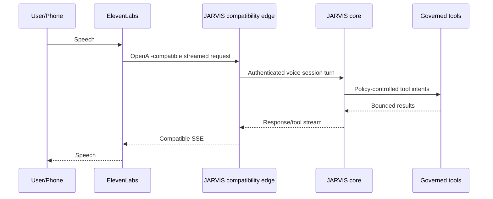
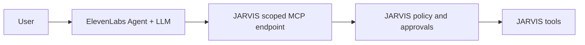

# Voice and Telephony Architecture

Status: PROPOSED
Last source review: 2026-09-21

## Principle

Voice is a channel into JARVIS. It does not own canonical identity, memory,
policy, tools, workflows, or reasoning. Every voice provider implements a
replaceable adapter over JARVIS call/session contracts.

## Carrier and Pipeline Are Separate Choices

JARVIS distinguishes three things that are easy to conflate:

| Layer | Examples | Owned by |
| --- | --- | --- |
| **Carrier** | telephone numbers, PSTN legs, SIP trunks | replaceable adapter |
| **Audio pipeline** | text relay vs raw audio vs speech-to-speech | replaceable adapter |
| **Reasoning** | context, model, tools, policy | **JARVIS** |

The carrier and pipeline above describe a **telephone call**. A session that is not
a call — a shared screen, a camera, a live multi-participant conversation, or a
non-telephony realtime channel — is governed separately by
[realtime media sessions](realtime-media.md) and
[the media session contract](../contracts/media-session.md). A bridged call is a
participant inside such a session; the call state machine remains this document's.

The measured baseline comes from a text relay on one carrier; the preferred
personal mode uses a different pipeline on a different provider. **A latency
number belongs to a pipeline, not to "voice", and must never be restated as if it
supported a pipeline it was not measured on.** Evidence and the recorded numbers:
[Twilio telephony](../research/integrations/telephony-twilio.md).

Two rules follow:

- **Pipeline mode is selected in exactly one place.** A text-in/text-out relay and
  a raw-audio mode may be mutually exclusive at the carrier with no error and no
  warning, so a call can silently run as the wrong architecture and every number
  collected from it is then attributed to the wrong system. Choose once, log the
  choice on every ingress, and assert the serialized provider request.
- **Provider defaults that change pipeline semantics are set explicitly.** Voice
  carriers have changed behavior defaults without versioning, and vendor SDKs drop
  unknown attribute names silently, so an inherited default and a typo are
  indistinguishable from a working configuration until a call behaves wrongly.
  Every attribute the turn-taking depends on is written explicitly and asserted.

The raw-audio format is a design input, not a detail: telephony media is narrow
band μ-law, so owning the audio path means owning resampling, framing, and
playback quality as well as turn taking.

## Voice Provider Port

The domain needs provider-neutral operations and events such as:

```rust,ignore
trait VoiceProvider {
    async fn start_outbound_call(
        &self,
        request: OutboundCallRequest,
    ) -> Result<ProviderCall, VoiceError>;

    async fn end_call(&self, call: CallId) -> Result<(), VoiceError>;
    async fn status(&self, call: CallId) -> Result<CallStatus, VoiceError>;
}
```

Realtime audio streaming may use a separate session/transport port. Provider
IDs and webhook payloads remain adapter details.

## ElevenLabs Mode A: JARVIS Is the Brain

This is the preferred personal JARVIS mode.



Current official ElevenLabs docs support custom LLM servers using either
`/v1/responses` or `/v1/chat/completions`, both streamed with SSE. JARVIS should
implement Responses first, then Chat Completions only for tested compatibility.

The compatibility edge must support currently documented ElevenLabs system-tool
function calls, including end, language switch, transfer, skip turn, and
voicemail behavior when configured. These calls alter call state through the
voice adapter; they do not become general JARVIS tools without policy metadata.

## ElevenLabs Mode B: ElevenLabs Agent Uses JARVIS MCP

An independently configured ElevenLabs agent may own its LLM while connecting
to JARVIS as a remote MCP server.



Use Streamable HTTP for new integrations. ElevenLabs currently documents both
SSE and Streamable HTTP MCP transports, but JARVIS should not add a legacy
transport unless live compatibility requires it.

ElevenLabs approval configuration is defense in depth. JARVIS policy remains
authoritative, especially for communication, destructive, code, financial,
privileged, and physical effects.

## Session Bootstrap and Identity

Do not trust phone number, caller ID, model-supplied `user_id`, dynamic variables,
or arbitrary extra body fields as authenticated identity.

Preferred flow:

1. JARVIS creates a short-lived opaque voice session token bound to expected
   provider/agent, call direction, user/workspace candidate, scopes, expiry, and
   nonce.
2. The token is passed through a provider-supported secret/dynamic field or
   authorization header after current docs verification.
3. ElevenLabs calls the compatibility/MCP endpoint over TLS.
4. JARVIS validates token, provider client credential, replay state, and call ID.
5. The session starts at the assurance level actually proven.
6. Sensitive reads/actions require step-up in another authenticated channel or
   an approved voice verification method.

Inbound unknown callers receive a guest session with no private workspace
retrieval or side-effecting tools.

## Call State

The [provider-neutral voice call contract](../contracts/voice-call.md) owns the
executable transition table, normalized events, turn/interruption behavior,
callback conflict resolution, idempotency, and terminal reconciliation. The
summary below is architectural, not a provider wire contract.

```text
CREATED
DIALING
RINGING
CONNECTED
AUTHENTICATING
ACTIVE
TRANSFERRING
ENDING
COMPLETED
FAILED
CANCELLED
```

Store provider call/conversation IDs, direction, owner/workspace candidate,
assurance, reason, related workflow/event, consent basis, timestamps, status,
usage/cost, transcript/audio references under retention policy, tool calls,
outcome, and failure classification.

Provider callbacks are events and can arrive late, duplicated, or out of order.
Apply monotonic transition rules and reconcile with provider status where needed.

## Outbound Calling

An outbound call is an external communication/high-risk tool. Before dialing:

- target number/account is normalized and allow/deny checked;
- user consent and applicable regional/organizational policy are recorded;
- purpose, identity disclosure, and expected agent behavior are explicit;
- quiet hours, timezone, frequency, concurrency, and spend budgets pass;
- one-shot approval is bound to number, purpose, script/context class, and time;
- an idempotency key prevents duplicate dialing;
- voicemail, retry, transfer, and escalation policy is known;
- emergency numbers and prohibited destinations are denied by default.

Batch or mass calling is outside initial scope and requires a dedicated legal,
abuse, consent, opt-out, rate, and monitoring design.

## Post-Call Webhooks

- Verify provider signature/current official mechanism over raw request bytes.
- Persist delivery ID and call mapping before acknowledgement.
- Treat transcript, analysis, and extracted fields as untrusted provider output.
- Reconcile callback status against the current call transition.
- Never let callback-supplied workspace/user IDs select tenant data.
- Store audio only when policy and consent permit; default to the minimum useful
  retention.

## Latency and Turn Behavior

### The latency budget

A voice turn's budget is **perceived** latency: end of caller speech to the first
audio the caller hears, measured at p50 and p95 on real calls. A turn is only
acceptable when the measured budget passes; an unmeasured claim of "low latency"
is not evidence.

Components are tracked and reported **separately**, because conflating them hides
which one is slow:

- transport connection and authentication;
- **end-of-turn detection**;
- STT finalization where the pipeline has a separate STT stage;
- JARVIS context build;
- model time to first token;
- tool wait and approval wait;
- text-to-speech first audio;
- total turn latency and interruption response.

End-of-turn detection and generation are reported **side by side and not summed
into one number**, because they are additive: the caller's pause is spent before
the model is even asked. A single combined figure cannot tell you whether to
change the model, shorten the reply, or change turn detection, so a combined
figure is a measurement defect rather than a summary.

Component semantics that must travel with every number:

- "end of speech" is when the **provider told us** the caller stopped, not when
they actually stopped. The real wait is longer by up to the maximum-silence
configuration.
- A latency figure from a pipeline whose clock stops when **text exists** is not
comparable to one from a pipeline that has already **synthesized speech**. State
which pipeline a number belongs to.

### Turn detection

End-of-turn is decided by a **model-based signal** with a configurable confidence
threshold, not by a fixed silence window alone. A silence timer fails on exactly
the utterances a personal assistant receives most:

> "check my email and reply to the one from Sam... uh... the invoice"

A silence window cuts that off mid-thought; the caller repeats themselves, which
costs far more time than the window saved. Every mainstream voice platform has
already converged on a model rather than a threshold, so this is not a vendor
preference.

The adapter must therefore expose:

- a **confidence threshold** for finishing a turn;
- a **maximum-silence cap** as a backstop, which is the only remaining meaning of
  a silence timeout and can be raised without paying a latency penalty;
- a **partial-transcript channel** so unfinalized speech and eager end-of-turn
  signals are observable. Where the provider withholds these by default, enabling
  the channel is proven rather than assumed, and turn-detection time is otherwise
  immeasurable.

### Interruption

Interruption is a policy, not a switch. The adapter exposes which input may stop
speech, how sensitive that trigger is, and whether short conversational
backchannels are filtered so that "yeah" and "uh-huh" do not cancel a reply.
Backchannel filtering is not the same capability as recovering from a false
interruption: the first prevents a spurious stop, the second resumes a reply after
one. The call controller's turn states must distinguish them, because resuming
requires knowing what was already spoken.

### Tool wait

Voice context uses a smaller, preselected tool/memory budget than long-form chat.
A slow tool must acknowledge progress through a **provider-sanctioned** mechanism
or move the call into an explicit hold/wait state. Provider-documented progress
filler is permitted; fabricated filler that implies an action already succeeded is
not, and a tool result that only drafted or proposed must not be spoken as
done. Approval waits that cannot complete within voice policy become an explicit
follow-up or step-up response rather than an open stream.

## Privacy and Safety

- Clearly disclose AI/recording where law or policy requires it.
- Offer retention/audio-saving/zero-retention settings where provider support
  and product mode permit.
- Redact transcripts and post-call data according to workspace policy.
- Never use voice biometrics as sole authentication without a separately
  reviewed design.
- Prevent spoken prompt injection from becoming system policy.
- Require non-voice step-up for critical actions by default.
- Give the user immediate end-call and revoke-session controls.

## Provider Replacement

ElevenLabs-specific endpoints, event names, tools, and webhook shapes stay in
its adapter/evidence note. JARVIS call state, policy, context, tools, audit, and
workflow triggers remain provider-neutral so local STT/TTS, OpenAI Realtime,
SIP-native, or future providers can be added without migrating canonical data.

**A voice agent framework is a runtime, not an architecture.** A framework that
owns turn detection, tools, MCP, tasks, handoffs, and per-stage fallback overlaps
capabilities JARVIS already owns. If one is adopted, it is adopted behind the
runtime protocol as a replaceable adapter (ADR-0005), it receives scoped tool
grants rather than ambient credentials, and its tool and state proposals are
validated by JARVIS policy. Its session and checkpoint state is runtime state, not
canonical call state. Framework-owned tools or MCP wiring must never become the
JARVIS implementation, because that is the second control plane ADR-0007 forbids.
See [LiveKit evidence](../research/integrations/livekit.md).
## Acceptance Tests

- inbound known and unknown caller identity levels;
- invalid/expired/replayed voice session token;
- exact Responses and Chat Completions SSE framing;
- function/system-tool call round trip;
- scoped MCP discovery and denied tool;
- interrupt while speaking and while a tool is pending;
- end, transfer, voicemail, disconnect, and provider outage;
- duplicate/out-of-order post-call callbacks;
- outbound quiet hours, denial, approval expiry, and no-double-ring;
- transcript/audio retention and redaction;
- provider kill switch during an active and scheduled call;
- perceived-latency budget at p50/p95 with end-of-turn reported separately, per
pipeline;
- mid-thought pause not cut off by a silence window, with the configured threshold
and maximum-silence cap proven present in the serialized provider request;
- partial text observed, discarded from durable state, and unable to execute a
tool;
- backchannel filtered without suppressing a genuine interruption.