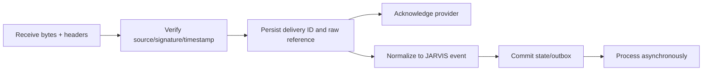

# Events, Scheduling, and Workflows

Status: PROPOSED

## Separation of Concerns

- **Event**: an immutable statement that something occurred.
- **Command**: a request to attempt an action.
- **Schedule**: a policy for creating a command/event at a future time.
- **Workflow**: durable orchestration across steps and waits.
- **Agent run**: nondeterministic reasoning activity invoked by a workflow or user.

Do not keep a model call open to represent a timer or business process.

## Event Envelope

Every durable event contains:

```text
event_id
event_type and schema_version
occurred_at and recorded_at
producer and producer_version
principal/workspace scope
correlation_id and causation_id
aggregate_type/id and aggregate_version where applicable
deduplication key or external delivery ID
payload/content reference
sensitivity and retention labels
trace context
```

Event payloads are versioned independently. Consumers ignore unknown additive
fields and reject unsupported breaking versions with diagnostics.

## Delivery Semantics

The initial event system is database-backed:

1. Persist state and outbox row in one transaction.
2. A dispatcher claims outbox rows with a lease.
3. Deliver to in-process subscribers or durable consumers.
4. Consumer records inbox/deduplication state and its state change atomically.
5. Dispatcher retries with bounded backoff until delivered or dead-lettered.

This is at-least-once delivery. Effectively-once outcomes require idempotent
handlers and external effect ledgers. Documentation must not claim exactly-once.

Tokio broadcast/mpsc channels may reduce local latency but are not the durable
record and cannot be the only path for important events.

## Event Ingress

External webhook/event handling follows:



Provider acknowledgement deadlines must not force full downstream processing in
the HTTP request. Invalid signatures fail before payload parsing beyond what is
needed for verification.

## Scheduler

A scheduled job contains timezone, recurrence/one-shot policy, next fire time,
misfire policy, overlap policy, jitter, owner/workspace, enabled state, command
template reference, and budget/policy constraints.

Workers claim jobs with expiring leases and fencing tokens. Clock jumps,
daylight-saving transitions, duplicate wake-ups, long downtime, and disabled
jobs are tested with an injected clock.

Misfire policies include:

- skip missed occurrences;
- run once now;
- catch up to a bounded count;
- require user review.

Never run an unbounded backlog after downtime.

## Workflow Model

A workflow definition is versioned and immutable for active executions. A run
stores the definition version and step graph. New executions can use a new
version; migrations of active runs are explicit.

Initial step kinds:

- action/activity;
- sequence and bounded parallel fan-out;
- condition/switch;
- wait-until/timer;
- wait-for-event with correlation predicate;
- request/wait-for-approval;
- invoke/wait-for-agent-run;
- compensation;
- terminal success/failure/cancel.

Every step declares input/output schema, retry/timeout, idempotency, and
compensation semantics.

## Workflow States

```text
PENDING
RUNNING
WAITING_TIMER
WAITING_EVENT
WAITING_APPROVAL
RETRY_SCHEDULED
COMPENSATING
COMPLETED
FAILED
CANCELLED
```

Transitions use optimistic versioning. A worker lease allows execution but does
not replace state-version checks.

## Nondeterminism

Model calls, time, randomness, network requests, and tools are activities with
persisted inputs/outcomes. Workflow transition logic consumes recorded outcomes
and should be deterministic for replay/debugging.

Native v1 workflows need not reproduce Temporal's event-sourced replay engine,
but they must not hide side effects inside transition code.

## Retries and Side Effects

- Retry only typed retryable failures.
- Respect workflow deadline and per-step attempt budget.
- Persist next-attempt time and policy version.
- Reuse idempotency key across attempts of one logical side effect.
- Place ambiguous external outcomes into reconciliation/manual review.
- Compensation is a new best-effort action, not time reversal.

## Proactive Engine

Proactive rules match events and may start workflows. Before activation, a rule
declares:

- owner and workspace;
- trigger/filter and cooldown/deduplication window;
- allowed actions and maximum risk;
- quiet hours/timezone and notification channel;
- frequency, token, cost, and external-effect budgets;
- required approval behavior;
- explanation shown to the user;
- kill switch and expiry.

The proactive engine must prefer preparing/asking over interrupting/acting until
the user explicitly grants a broader standing policy.

## When to Add Temporal

Temporal remains an optional workflow backend. Evaluate it only when measured
needs include several of:

- high numbers of long-lived workflows and timers;
- multiple languages needing one durable orchestration service;
- horizontal workers across regions;
- native engine maintenance exceeding product value;
- operational need for mature replay/versioning/visibility tooling;
- requirements that cannot be met safely by the database-backed engine.

An adapter must preserve JARVIS workflow IDs, policy, approvals, tool fabric,
and canonical state. Temporal workflows would orchestrate; external calls and
model/tool operations remain activities.

## Required Tests

- crash before/after every persisted transition;
- duplicate outbox/inbox delivery;
- lease expiry and two workers racing;
- timer misfire and daylight-saving boundaries;
- cancellation during activity and wait states;
- approval approve/reject/expire after restart;
- ambiguous side effect and reconciliation;
- workflow definition upgrade with active old runs;
- dead-letter inspection and safe replay;
- proactive cooldown, quiet hours, and budget enforcement.