# Skill Contract

Status: ACCEPTED
Lifecycle: DRAFT
Owner: tool fabric and memory
Minimum JARVIS version: 1.0

This contract defines the persisted and wire shape of a **skill**, the procedure
an agent or a user can author, install, load, and revoke. It is normative for the
`TLS-016`, `MEM-011`, `MEM-013`, `BRN-082`, and `PRD-010` slices and for the
`ACC-084` through `ACC-089` scenarios.

The decision behind this contract is
[ADR-0012](../adr/0012-governed-learning-loop.md). Where prose here and the ADR
disagree, the ADR is the authority for the decision and this document is the
authority for the shape.

## 1. What a Skill Is

A skill is a versioned procedure that composes tools. It is not a tool, not a
grant, and not a policy.

- **A tool is an atomic capability** with typed input/output, effects, risk, and
  a canonical identity (`tool-contract.md`).
- **A skill is orchestration** — instructions or a deterministic workflow that
  composes tools toward a repeatable task.
- **A grant is authority.** Loading a skill never creates one.

The three are stored, authorized, and audited separately. A skill references tools
by canonical identity; it never embeds a tool implementation, a credential, or a
grant.

## 2. Skill Record

A persisted skill contains at least:

```text
skill_id                stable, namespaced, immutable once published
name                    human-readable alias, not an authorization input
version                 semantic version of the skill's own content
content_hash            sha256 over the exact skill body and its reference files
source                  authored | bundled | installed | learned
publisher               owner/provenance; a learned skill names the run that wrote it
trust_tier              builtin | official | trusted | community | learned
capability_declaration  the tools and scopes the procedure expects to use
required_scopes         declared, never granted by loading
risk_summary            derived from the declared tools, not from skill prose
inputs / outputs        optional typed shape for a deterministic skill
procedure               ordered instructions or a workflow definition
references              topic-named files loaded on demand, each content-hashed
compatibility           minimum JARVIS version and tool major versions
provenance              for a learned skill: run_id, evidence, and the candidate it came from
```

**`content_hash` covers every file the skill can load, not only the entry body.**
A reference file a procedure loads on demand is part of the procedure, so a skill
whose body is unchanged but whose reference file changed is a *different* skill —
which is what makes decision 5 of the ADR enforceable.

## 3. The Authority-Narrowing Invariant

**Loading a skill may narrow the tool catalog available to a call; it may never
widen authority.**

Formally, for a principal with grant set `G`, loading skill `S` yields catalog
`C ⊆ G`. A skill cannot:

- add a tool not in `G`;
- raise a risk ceiling;
- demote an approval requirement (`approval_required` → `automatic`);
- change an effect classification;
- add a scope, resource, or workspace;
- extend a timeout or a retry budget beyond the tool's own declared bounds.

This is a *requirement*, not a convention. An implementation that cannot prove it
is not complete, because the failure mode — a procedure that grants itself a
capability — is the single most dangerous thing a plugin or skill ecosystem can
carry. `ACC-085` is the scenario that asserts it, and it is asserted against a
skill that declares the expansion rather than a well-behaved one.

## 4. Trust Tiers

Every skill has a trust tier, and the tier decides which findings may be
overridden and which may not.

| Tier | Origin | Install policy |
| --- | --- | --- |
| `builtin` | Ships with JARVIS | Always trusted; scanned for completeness, never blocked |
| `official` | Published by the JARVIS project | Built-in trust; no third-party warning |
| `trusted` | Reviewed registries the project pins | More permissive; dangerous findings still block |
| `community` | User-installed from any other source | Full scan; a non-dangerous finding is overridable only by an explicit user override that is recorded |
| `learned` | Authored by an agent run | Deny-by-default; requires the learning grant and, by policy, review |

**A `dangerous` scan verdict is never overridable at any tier.** The override
exists for caution-level findings a user has read, not for a verdict that names
exfiltration, injection, or destructive commands.

The tier is recorded on the skill and travels with it. A skill cannot promote its
own tier by being re-imported from a higher-trust source name: the tier comes from
the *resolved source*, not from a field the skill declares.

## 5. Install, Scan, and Quarantine

Installing a skill is a canonical tool call with declared effects and risk, and it
follows the standard path.

1. **Resolve the source** and record its exact identity (registry, repo, URL, and
   the resolved content hash).
2. **Fetch the declared files only.** The entry body plus the exact referenced
   files it names. Unreferenced files are not copied.
3. **Scan the complete bundle before it is usable.** The scan is content-hash
   cached and re-run when the content changes. A skill that cannot be scanned is
   not installed.
4. **Quarantine a dangerous verdict.** A quarantined skill does not appear in the
   index, cannot be loaded by name, and is not a slash command. It stays on disk,
   inert and inspectable, rather than being silently deleted.
5. **Record provenance** — source, resolved hash, scanner version, findings,
   timestamp, and fresh-or-cached status — in a lockfile the user can read.

A scan is **advisory or blocking by tier**, and the decision is written down:
`builtin`/`official` are scanned for completeness; `community`/`learned` are
gated. Findings that name real credential material are shown with file and line
so the user can decide before the install completes.

## 6. Progressive Disclosure

A skill loads in three levels, and each level is a separate context-manifest
entry so the budget explains itself:

```text
Level 0  index      { name, description, tier, declared capabilities }   ~one line each
Level 1  body       the full procedure, loaded when a task needs it
Level 2  reference  one named file under the skill's references/, loaded on demand
```

**The index is the only level present in every prompt.** Loading level 1 appends a
manifest entry naming the skill and its token estimate; loading level 2 appends a
narrower one. A system-prompt mutation that is not reflected in the manifest is a
defect, because the manifest is how a reader answers "why was this in the
context".

A skill whose body exceeds a bounded size is refused or split rather than loaded
whole, because a body loaded once stays in context for the remainder of the run.

## 7. Learning Writes

The following are canonical tools. Each declares its effects, risk, timeout, and
idempotency, and each passes through the standard path.

| Operation | Input | Effect | Notes |
| --- | --- | --- | --- |
| `skill.author` | name, category, body, optional references | `write` | Creates a `learned`-tier skill bound to the producing run |
| `skill.patch` | name, targeted edit | `write` | Preferred over a full rewrite; token-efficient and reviewable |
| `skill.delete` | name | `destructive` | Removes a `learned` skill; a bundled or installed skill is disabled, not deleted |
| `memory.promote` | typed memory candidate | `write` | Promotion into a durable memory class with provenance |

Two rules are structural rather than documented:

- **There is no write that is not a tool call.** No module may write the skill or
  memory store directly. `ACC-084` asserts the absence of such a path by attempting
  to reach the store outside the tool fabric.
- **A learning write is idempotent by key.** A retried review after a crash cannot
  create a second copy of the same skill, because the write carries an idempotency
  key derived from the candidate, not from the attempt.

### 7.1 The Review Job

The post-turn review that proposes learning is a durable workflow run:

- It is persisted before it produces any effect, so it resumes after a crash.
- It carries a cumulative input-token budget; the review stops before crossing it,
  and a review that stops on budget reports that it did so.
- It routes to a configured auxiliary model when one is set, and otherwise reuses
  the parent model's prompt-cache prefix rather than replaying a cold transcript.
- Its candidates are **proposals**. Whether a proposal becomes a durable write is a
  policy decision, and a sensitive candidate additionally requires user
  confirmation.
- It never reads from or writes to hidden chain-of-thought.

### 7.2 Candidate → Write Pipeline

```mermaid
flowchart LR
    Turn[Completed run] --> Review[Durable review workflow]
    Review --> Candidate[Typed candidate + evidence]
    Candidate --> Classify[Class, scope, sensitivity]
    Classify --> Policy[Policy: may it be written?]
    Policy --> Confirm[Confirmation if sensitive]
    Confirm --> Tool[Canonical learning tool call]
    Tool --> Commit[Durable skill or memory + provenance]
    Commit --> Inspect[Inspect, correct, revoke, export]
```



## 8. Binding, Review, and Revocation

- **A grant names the exact implementation.** A grant or approval recorded against
  a skill names its `content_hash` and the schema fingerprints of the tools it
  declares. A changed hash or a changed capability set requires a new grant; the
  old one does not silently carry forward. This is the skill-level form of the rule
  `ACC-024` applies to tools.
- **A learned skill is reviewed by default.** With review enabled, a proposed
  write is staged rather than applied, survives a restart, and is approved or
  rejected with a diff. A write that was staged against one content hash is refused
  if the target changed before approval.
- **Revocation is immediate and complete.** Disabling a skill removes it from the
  index, from slash commands, and from any load path, for new runs. It does not
  retroactively alter a run that already completed.
- **Export and deletion are supported.** A user can export the learned set with
  provenance and delete it, consistent with `FR-MEM-003`.

## 9. What This Contract Does Not Cover

- **Tool identity and the execution path** — `tool-contract.md`.
- **Plugin manifests and process isolation** — `plugin-manifest.md`. A skill is
  data; a plugin is code. A plugin may *provide* skills, but the skill is still
  data loaded under this contract.
- **Memory classes and retrieval** — `memory-context.md` and `data/schema.md`.
- **Runtime-provided checkpoints** — `runtime-protocol.md`. A runtime checkpoint is
  runtime state, never a skill or a memory.

## 10. Required Tests

- a learning write reaches the canonical tool path and a write outside it does not
  exist;
- a skill that declares a capability expansion is refused, and its complement — a
  skill that declares a subset — is accepted;
- a changed content hash or capability set invalidates the prior grant;
- a retried review produces one skill, not two;
- a review stops at its input-token budget and reports the stop;
- a quarantined skill is absent from the index and cannot be loaded by name;
- a sensitive candidate is not written without confirmation;
- a revoked skill is absent from the index for new runs and its prior runs are
  unchanged.

## 11. Implementation Status

**Implemented**: the *authority-narrowing invariant* (section 3) as a type, its trust-tier
policy (section 4), the skill record's identity fields (section 2), and the content hash's
**coverage rule**.

- **The invariant is `jarvis_domain::skill::SkillCatalogNarrowing`.** Its only operation is
  `narrow(&granted)`, which either returns a catalog that is a subset of the principal's
  grants or returns **every** expansion that prevented it, each naming its own dimension and
  code (`skill.ungranted_tool`, `skill.added_scope`, `skill.added_effect`, `skill.raised_risk`,
  `skill.raised_sensitivity`, `skill.relaxed_approval`, `skill.extended_timeout`,
  `skill.raised_attempts`). There is no accessor that hands back the declaration un-narrowed,
  because such an accessor is how a caller would load a skill without consulting the rule.
- **`ACC-085` is evidenced in the domain**, and the complement it demands is asserted
  separately: `a_strict_subset_of_the_grant_is_accepted` and
  `a_skill_that_declares_the_whole_authority_is_accepted` exist so the eight refusals cannot be
  satisfied by an implementation that refuses everything — the same control the plugin
  verifier's accepting case provides. `a_relaxed_approval_is_refused` asserts **both**
  directions in one test, because that predicate's reversal is the quietest: the domain orders
  `Allow < Ask < Deny`, so a declared posture *below* the granted one is the demotion
  `approval_required → automatic`, and a comparison written the other way accepts exactly that
  case. Every refusal test asserts the **code** rather than only `is_err`, so a reversed subset
  test fails on the dimension it reversed rather than passing on a refusal for another reason.
- **A dangerous verdict is not overridable, and the implementation makes that absolute rather
  than configured.** `SkillTier::may_override` does not consult its `explicit_override`
  parameter for `ScanVerdict::Dangerous` at all, so no caller can pass a flag that overrides it.
  `a_dangerous_verdict_is_never_overridable_at_any_tier` asserts the property over **every tier
  and both states of the flag**, which makes it a statement about the rule rather than about one
  tier. `a_caution_verdict_is_overridable_only_by_an_explicit_recorded_override_at_community`
  asserts the full matrix, so a rule that flipped one cell fails on the cell.
- **The content hash covers every file the skill can load**, which is the property section 8's
  grant binding and ADR-0012's decision 5 depend on.
  `jarvis_infrastructure::tool_fingerprint::skill_content_hash` takes the body **and the
  references together**, so "hash the body alone" is not expressible at a call site — a function
  taking only the body could not satisfy this section, and a caller assembling the input itself
  would be free to forget the references. Each file is fed with its name and a separator, so
  order-independent (the references are a `BTreeSet`) **and** concatenation-unambiguous:
  `the_skill_content_hash_separates_files_from_their_concatenation` is the test for the second.
  Removing the reference loop fails `the_skill_content_hash_changes_when_only_a_reference_changes`
  and the concatenation test, and nothing else.
- **The tier comes from the resolved source, never from the skill**, which is why `SkillTier` has
  no parser from skill content: the installer assigns it from where it actually fetched the
  skill, and a wire field naming one is ignored rather than honoured. `SkillName`, `SkillSource`,
  and `ScanVerdict` all parse **fail-closed** — an unknown source does not become `Authored` and
  an unknown verdict does not become `Clean`, the same direction `Risk::parse` records.

**Not implemented, and each is a named slice:**

- **Progressive disclosure** (section 6) — the three manifest levels. The index/body/reference
  shape is `MEM-011`'s and needs a context-manifest writer; the domain has no business holding
  a token budget.
- **Install, scan, and quarantine** (section 5) — the scan pipeline, the content-hash cache, the
  quarantine state, and the provenance lockfile. `SkillTier::is_scan_gated` and
  `may_override` are the *policy*; nothing performs a scan yet.
- **Learning writes and the review job** (section 7) — `skill.author`, `skill.patch`,
  `skill.delete`, `memory.promote`, and the durable review workflow. These are `MEM-012` and
  `MEM-013`.
- **The skill store and load path.** No table, no loader, and no revocation writer exists, so
  `SkillCatalogNarrowing` currently has **no production caller** — it is the invariant the
  future loader must consult, and it is stated as such rather than implied to be wired. This is
  the "value with a producer and no consumer" shape this project keeps recording; here it is
  deliberate, because the loader is a larger slice and the invariant is the piece that must be
  right before it exists.
- **`SkillCapability` binds an exact `ToolIdentity`, so a recompiled tool is a different
  capability** — but nothing yet *resolves* a skill's declared identity against the catalog, which
  is the loader's job. The comparison is the invariant; the resolution is not built.
