# Retention, Export, and Deletion

Status: PROPOSED

## Principle

Retention is workspace policy constrained by legal/provider requirements and
user control. "Delete" must state which copies, derived data, provider-side
resources, backups, and audit exceptions are affected.

## Data Classes

| Class | Examples | Default direction |
| --- | --- | --- |
| Credentials | keys, refresh tokens, session secrets | Secret store; shortest necessary lifetime |
| Identity | users, memberships, devices | Account/workspace lifetime plus security audit |
| Conversation | messages, attachments | User-configurable; local by default |
| Memory | preferences, facts, procedures | Durable only with policy/provenance |
| Operational | health, logs, metrics, traces | Short bounded retention |
| Audit | approvals, tool effects, auth decisions | Policy-defined tamper-resistant retention |
| Voice | transcript, audio, analysis | Off/minimal by default; consent/provider-aware |
| Artifacts | files, generated outputs | Owner/purpose-specific expiry |
| Integration raw data | webhook payloads, provider responses | Minimize; normalized data preferred |

Every table/artifact has a retention class or inherits one explicitly.

## Policy Resolution

Effective retention is the most restrictive compatible result of:

- product safe default;
- user/workspace choice;
- data sensitivity;
- connector/provider contract;
- deployment region and legal hold;
- audit/security obligation;
- active workflow/run dependency.

Conflicts that prevent requested deletion are visible with reason and retained
metadata scope; they are not silently ignored.

## Export

Export produces a versioned manifest and portable records for user-owned data,
including memory provenance/corrections, conversations, tasks/workflows,
connector metadata without secret values, approvals/tool outcomes, and artifact
files where authorized.

- Verify hashes and record omissions/reasons.
- Encrypt exports containing sensitive data.
- Never include keychain/Vault values by default.
- External provider data remains subject to provider export/API rights.
- Export itself is audited and uses short-lived download access.

## Deletion Workflow

```mermaid
flowchart LR
    Request[Authenticated deletion request]
    Plan[Enumerate scoped data and exceptions]
    Confirm[Step-up/confirm]
    Freeze[Prevent new dependent writes]
    Delete[Canonical rows and artifacts]
    Derived[Indexes, embeddings, caches, summaries]
    Remote[Provider subscriptions/resources]
    Verify[Reconcile and report]

    Request --> Plan --> Confirm --> Freeze --> Delete --> Derived --> Remote --> Verify
```

Deletion is idempotent and resumable. It records non-sensitive proof and any
provider/legal exception without retaining the deleted content.

## Memory Forget Semantics

Distinguish:

- exclude from future context immediately;
- archive but retain for user restoration;
- supersede/correct while retaining lineage;
- hard-delete content and derived embeddings/indexes;
- remove source while retaining a disclosed unsupported provenance marker;
- legally retained audit fact without prompt-usable content.

The UI/API must use the exact operation name rather than one ambiguous "forget"
button behind different behavior.

## Backups

Backups age out under policy and are encrypted. Deletion reports the backup
retention window and prevents deleted content from returning to active state on
restore through tombstone/deletion-ledger reconciliation where required.

Backups containing legally deleted content are destroyed or cryptographically
erased according to deployment design.

## Provider-Side Data

Evidence notes document model/voice/connector retention and deletion APIs. JARVIS
can request provider deletion where supported but must distinguish requested,
accepted, completed, unsupported, and unverifiable states.

## Tests

- retention expiry with injected clock;
- active workflow dependency and legal-hold exception;
- export hash/schema and secret exclusion;
- deletion resume after crash;
- embeddings/search/cache disappear with source;
- cross-workspace deletion isolation;
- restore does not resurrect tombstoned data;
- provider cleanup retry/unsupported reporting;
- voice audio disabled while transcript policy differs;
- audit remains useful without retaining sensitive payload.